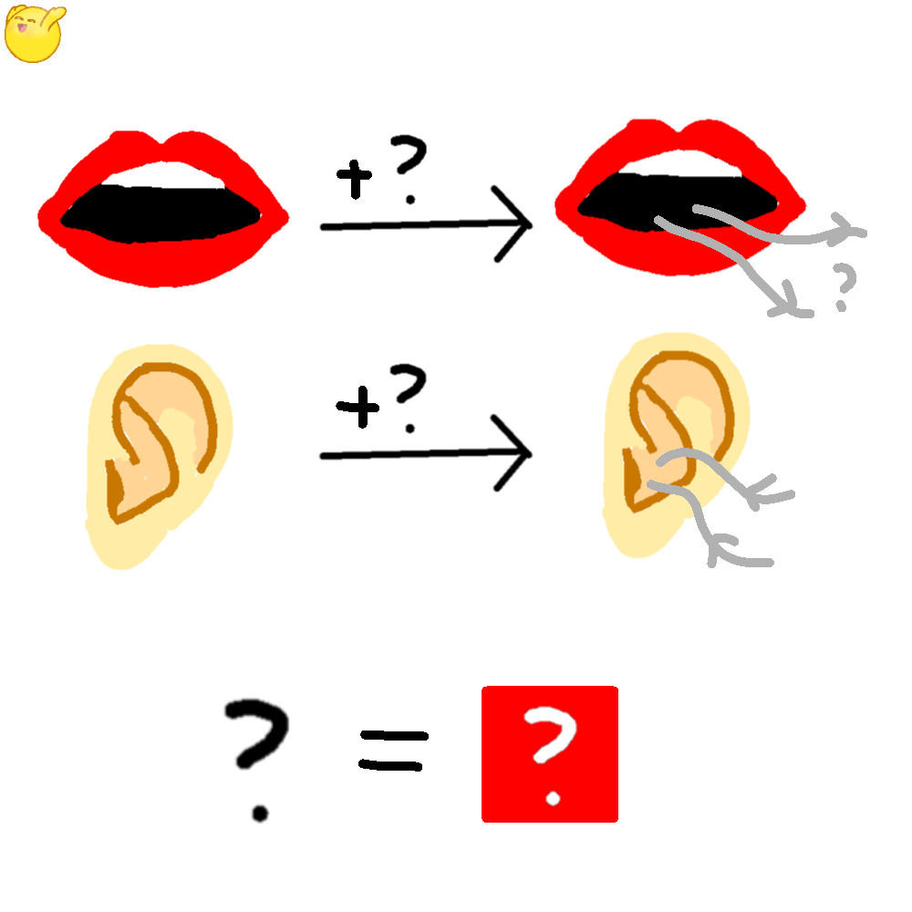

# 千字谜子题 415

## 题面

## 答案

`门`

## 解析

第一行为口→问，第二行为耳→闻，故问号所代表的字为“门”。

## 本地附件

- [6147cfbdfe794cd5940e2d8bb7c8381a.webp](../../../assets/static.cipherpuzzles.com/static/images/6147cfbdfe794cd5940e2d8bb7c8381a.webp)

来源：[https://ccbc16.cipherpuzzles.com/data/c16-qian-puzzle.json#cid=415](https://ccbc16.cipherpuzzles.com/data/c16-qian-puzzle.json#cid=415)
