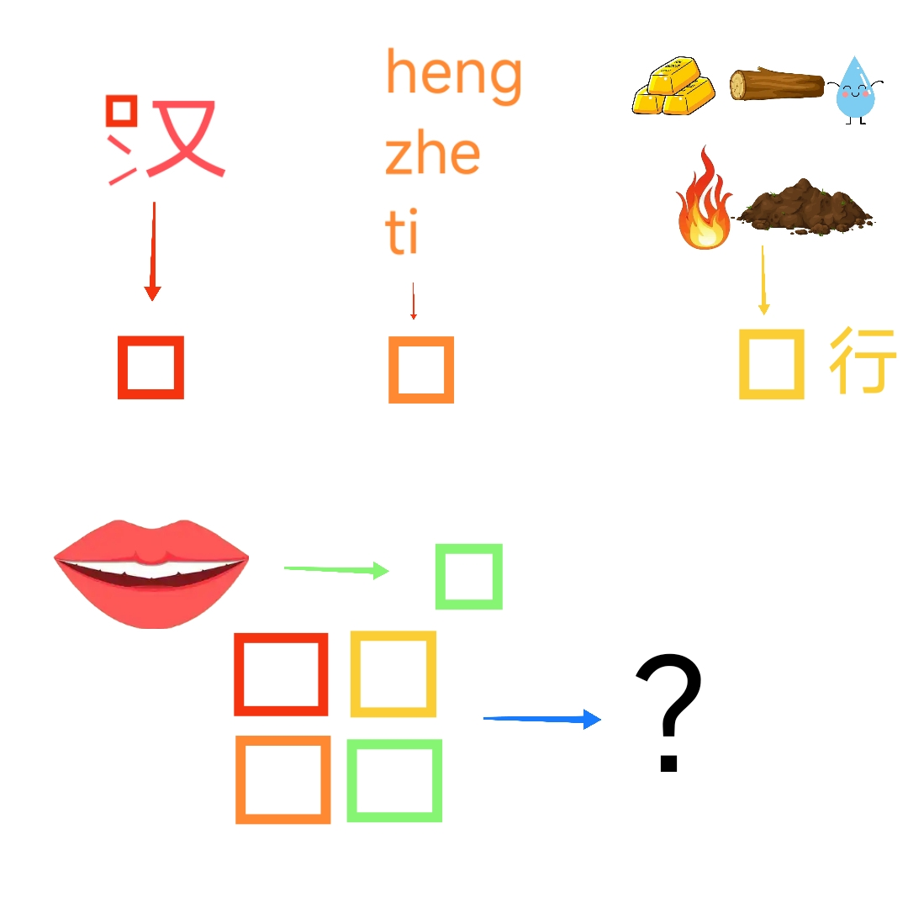

# 千字谜子题 418

## 题面

## 答案

`语`

## 解析

由题面，我们可以得知这是一道求部分然后组字的题目，思路就是求出方框内的部分或汉字，最后按最下方图示组字，可以从左往右求，亦可按照方框彩虹顺序求，第一个字为汉，方框内应为“丶”。第二个拼音转汉字为“横折提”，所以方框内应为“㇊”。第三个有图片金木水火土可知为五行，所以方框内应为“五”。最后一个嘴巴意为“口”，故方框内应为“口”。最后按最下方图示组字为“语”

## 本地附件

- [f3d4ca34db064124badaa41ee70b5cfe.webp](../../../assets/static.cipherpuzzles.com/static/images/f3d4ca34db064124badaa41ee70b5cfe.webp)

来源：[https://ccbc16.cipherpuzzles.com/data/c16-qian-puzzle.json#cid=418](https://ccbc16.cipherpuzzles.com/data/c16-qian-puzzle.json#cid=418)
