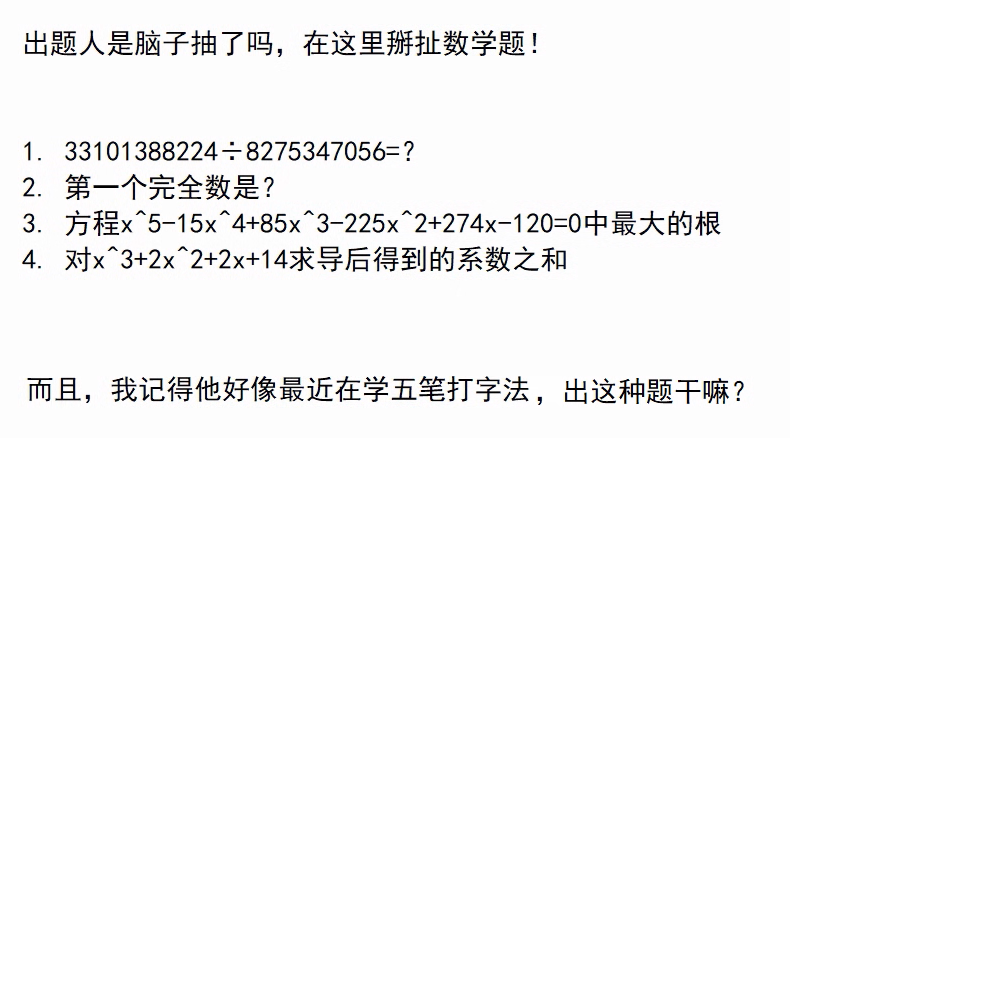

# 千字谜子题 419

## 题面

## 答案

`辰`

## 解析

既然题面中提到了五笔，解题过程中就需要用到五笔输入法.
解这四道题得到答案分别为4,6,5,9.
用A1Z26转换可得DFEI,再用五笔输入法转换即可得到答案"辰".

## 本地附件

- [ad4895b859d24ed4a233c54557ffb1eb.webp](../../../assets/static.cipherpuzzles.com/static/images/ad4895b859d24ed4a233c54557ffb1eb.webp)

来源：[https://ccbc16.cipherpuzzles.com/data/c16-qian-puzzle.json#cid=419](https://ccbc16.cipherpuzzles.com/data/c16-qian-puzzle.json#cid=419)
