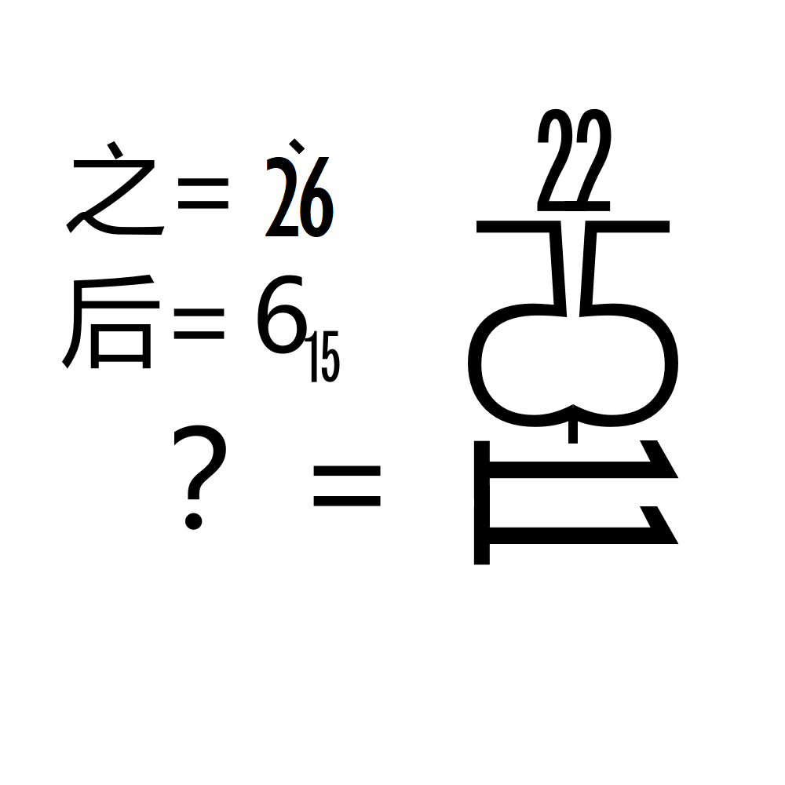

# 千字谜子题 42

## 题面

## 答案

`美`

## 解析

经典的A1Z26，数字对应大写字母，与额外的小方块一同近似表示汉字。
不同字宽控制一位数或两位数。(69对调的问题无需在意啦，反正可能性也就几个)

## 本地附件

- [acd5b704d9a74c4181b413f686eea583.webp](../../../assets/static.cipherpuzzles.com/static/images/acd5b704d9a74c4181b413f686eea583.webp)

来源：[https://ccbc16.cipherpuzzles.com/data/c16-qian-puzzle.json#cid=42](https://ccbc16.cipherpuzzles.com/data/c16-qian-puzzle.json#cid=42)
