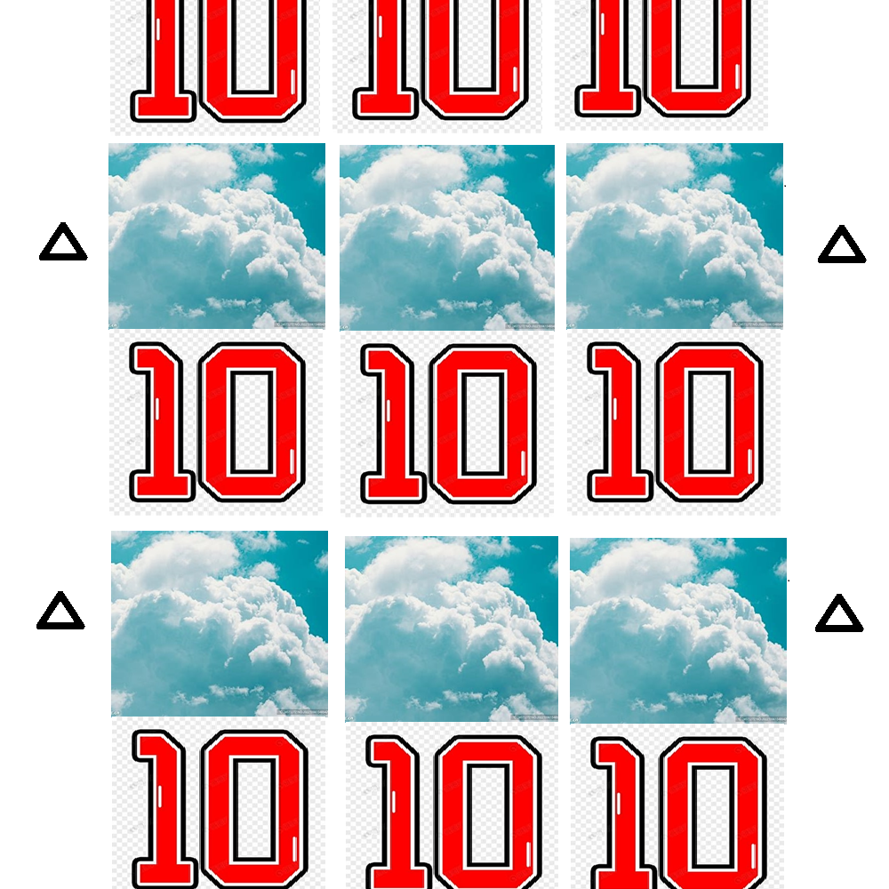

# 千字谜子题 420

## 题面

## 答案

`至`

## 解析

云十交替排列就是“至”字

（萌新第一次参加puzzlehunt，你们第一个审核不是给过了吗，这个是云上面一横循环移到下面，拼成一个至字）

## 本地附件

- [0b79d1b1692c438fb38644aedbd1206b.webp](../../../assets/static.cipherpuzzles.com/static/images/0b79d1b1692c438fb38644aedbd1206b.webp)

来源：[https://ccbc16.cipherpuzzles.com/data/c16-qian-puzzle.json#cid=420](https://ccbc16.cipherpuzzles.com/data/c16-qian-puzzle.json#cid=420)
