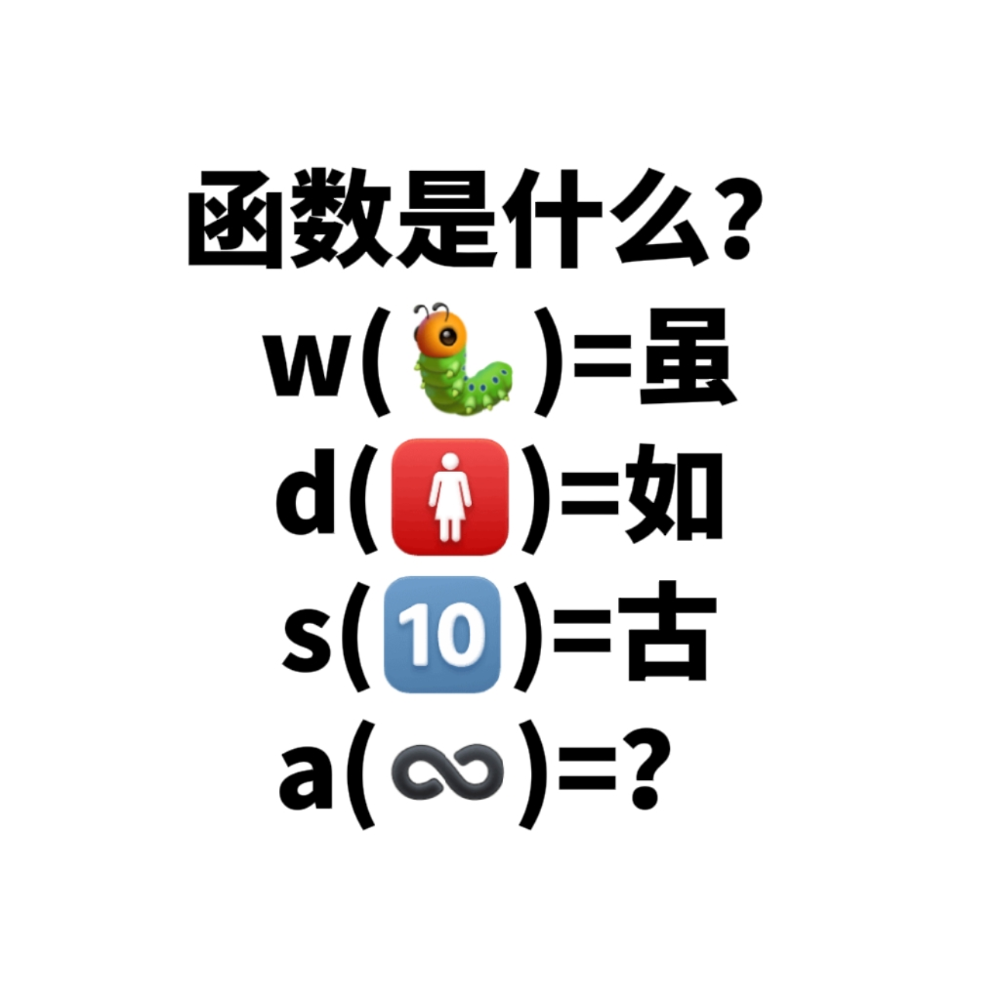

# 千字谜子题 422

## 题面

## 答案

`咏`

## 解析

如图为四个“函数”，“🐛”对应“虫”，“🚺”对应“女”，“🔟”对应“十”，“♾️”对应“永恒”即“永”，从上到下的四个“函数”以此代表在括号内emoji对应汉字的上方、右方、下方、左方添加“口”组成新字

## 本地附件

- [cc28ad153ee14179aed4856a835ab0af.webp](../../../assets/static.cipherpuzzles.com/static/images/cc28ad153ee14179aed4856a835ab0af.webp)

来源：[https://ccbc16.cipherpuzzles.com/data/c16-qian-puzzle.json#cid=422](https://ccbc16.cipherpuzzles.com/data/c16-qian-puzzle.json#cid=422)
