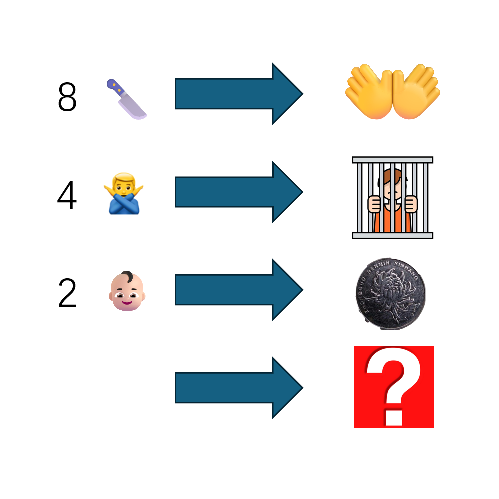

# 千字谜子题 424

## 题面

## 答案

`百`

## 解析

从上到下分别是八刀变成分，四非变成罪，二儿变成元，最后一行的数字按规律可以推理出1，后边的图片是白色的背景，即一白变成百

## 本地附件

- [348952320f754b62bb7024e7d5d08cda.webp](../../../assets/static.cipherpuzzles.com/static/images/348952320f754b62bb7024e7d5d08cda.webp)

来源：[https://ccbc16.cipherpuzzles.com/data/c16-qian-puzzle.json#cid=424](https://ccbc16.cipherpuzzles.com/data/c16-qian-puzzle.json#cid=424)
