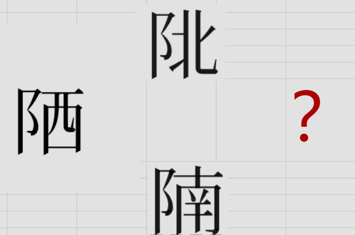

# 千字谜子题 425

## 题面

## 答案

`陈`

## 解析

方位。

## 本地附件

- [a105e7aa034745d29fe7e15027e543f4.webp](../../../assets/static.cipherpuzzles.com/static/images/a105e7aa034745d29fe7e15027e543f4.webp)

来源：[https://ccbc16.cipherpuzzles.com/data/c16-qian-puzzle.json#cid=425](https://ccbc16.cipherpuzzles.com/data/c16-qian-puzzle.json#cid=425)
