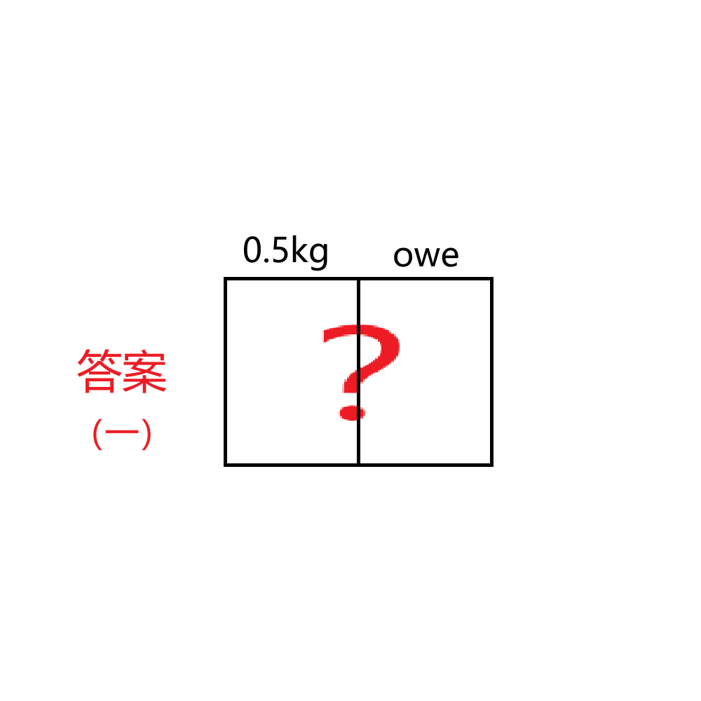

# 千字谜子题 429

## 题面

## 答案

`欣`

## 解析

0.5kg → 斤
owe → 欠
斤+欠 → 欣

## 本地附件

- [48de0d5b56d645a5b4cb588479b62a07.webp](../../../assets/static.cipherpuzzles.com/static/images/48de0d5b56d645a5b4cb588479b62a07.webp)

来源：[https://ccbc16.cipherpuzzles.com/data/c16-qian-puzzle.json#cid=429](https://ccbc16.cipherpuzzles.com/data/c16-qian-puzzle.json#cid=429)
