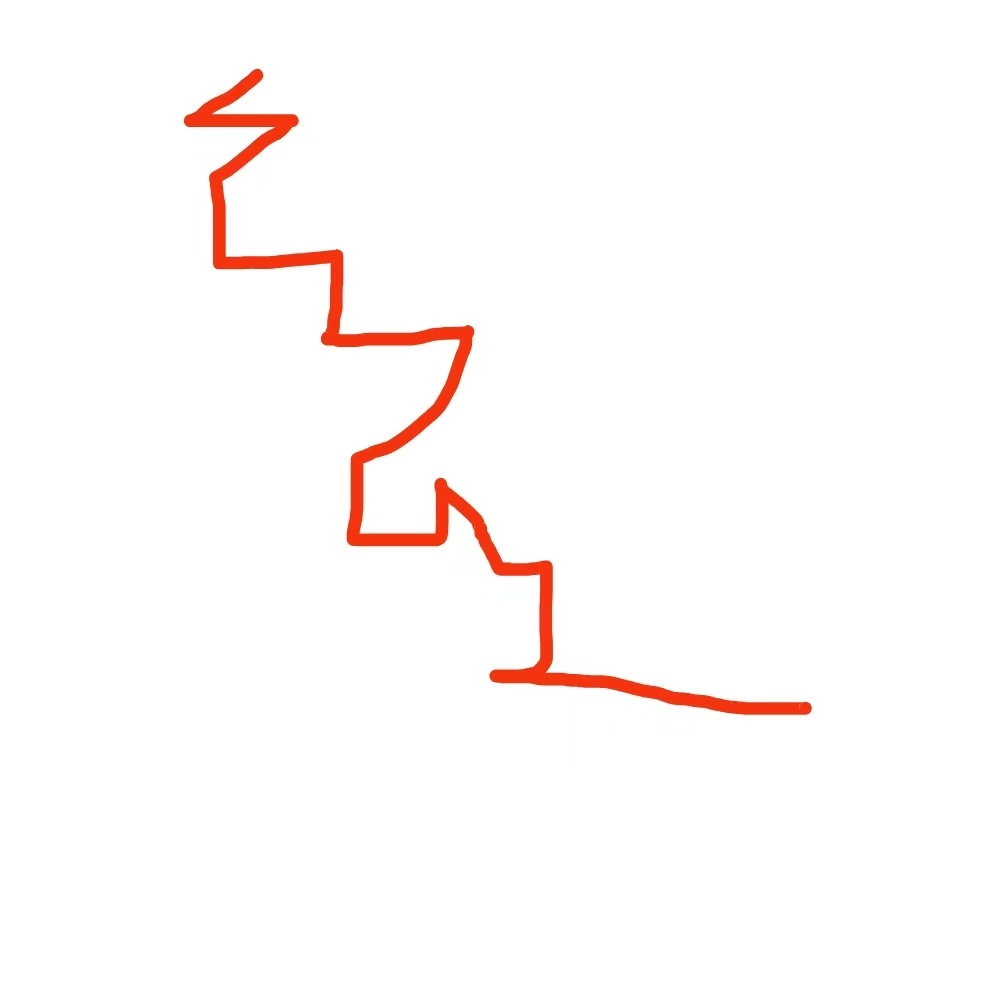

# 千字谜子题 43

## 题面

## 答案

`逸`

## 解析

参考CCBC16-一笔画

## 本地附件

- [fdef69a8a0864b4787ca944e592d865b.webp](../../../assets/static.cipherpuzzles.com/static/images/fdef69a8a0864b4787ca944e592d865b.webp)

来源：[https://ccbc16.cipherpuzzles.com/data/c16-qian-puzzle.json#cid=43](https://ccbc16.cipherpuzzles.com/data/c16-qian-puzzle.json#cid=43)
