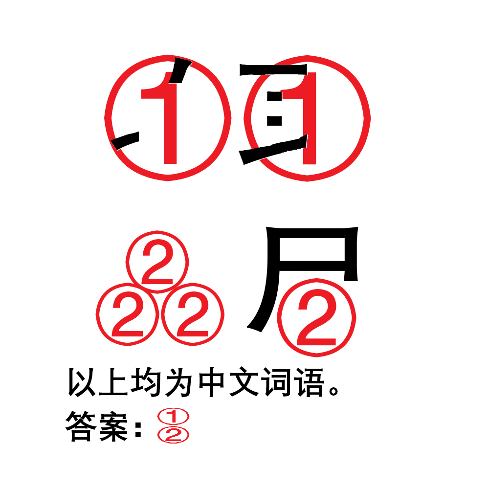

# 千字谜子题 430

## 题面

## 答案

`贤`

## 解析

显而易见的，两个词语分别是“收取”和“赑屃”，因此①=II又，②=贝，所以答案是贤。

## 本地附件

- [690fbee73f7342b19e9f745a2fa11ffd.webp](../../../assets/static.cipherpuzzles.com/static/images/690fbee73f7342b19e9f745a2fa11ffd.webp)

来源：[https://ccbc16.cipherpuzzles.com/data/c16-qian-puzzle.json#cid=430](https://ccbc16.cipherpuzzles.com/data/c16-qian-puzzle.json#cid=430)
