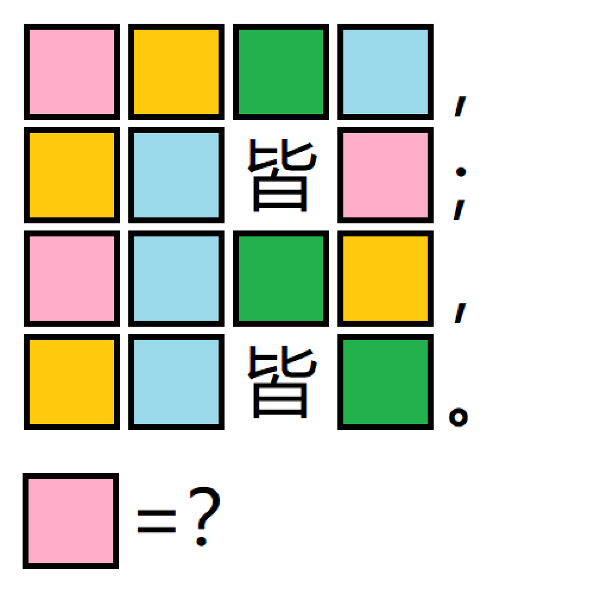

# 千字谜子题 431

## 题面

## 答案

`存`

## 解析

同颜色空格填入相同的字，空格填入的是：存人失地，人地皆存；存地失人，人地皆失。答案是存

## 本地附件

- [98d30722fad34c30b1d1479be8176a07.webp](../../../assets/static.cipherpuzzles.com/static/images/98d30722fad34c30b1d1479be8176a07.webp)

来源：[https://ccbc16.cipherpuzzles.com/data/c16-qian-puzzle.json#cid=431](https://ccbc16.cipherpuzzles.com/data/c16-qian-puzzle.json#cid=431)
