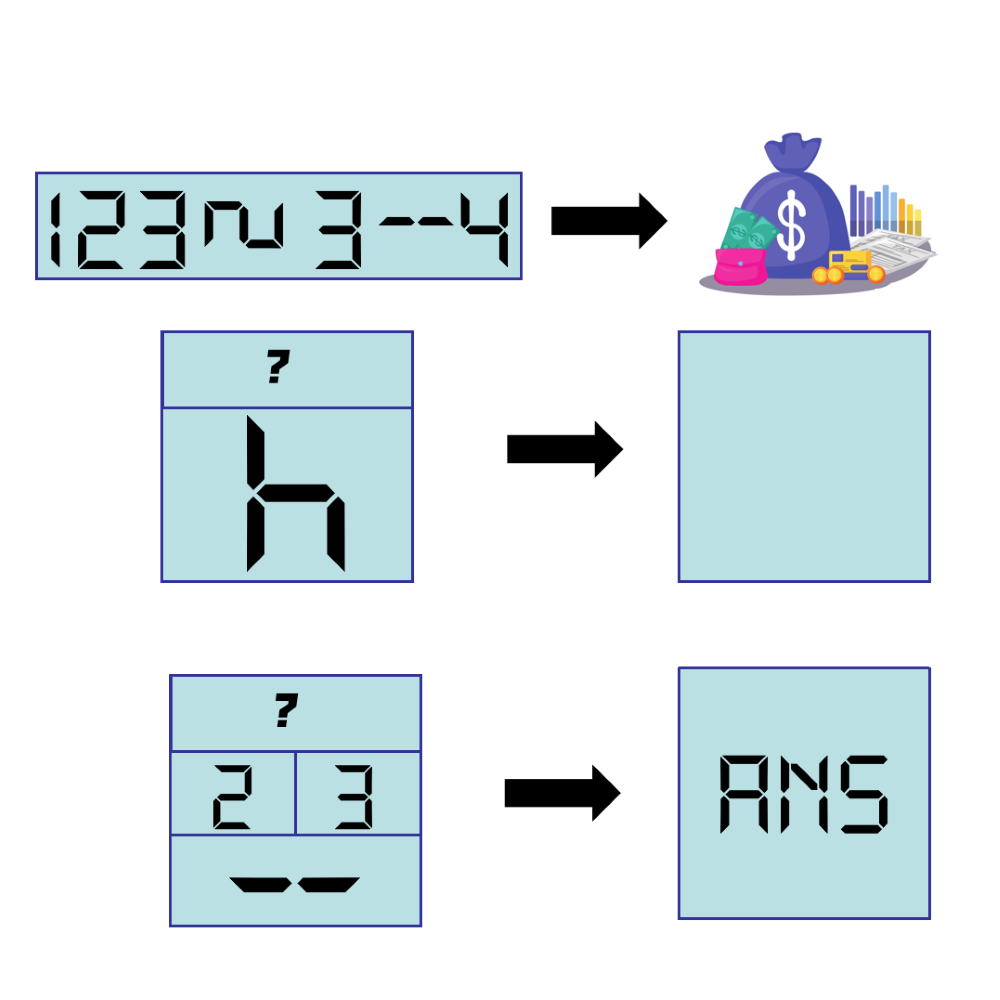

# 千字谜子题 433

## 题面

## 答案

`亩`

## 解析

最上面表示单词Economy，题目中所使用的数码管字体暗示字母也应用这个字体表示（n为c顺时针旋转90°，m为E顺时针旋转90°）
中间代表汉字“方”，由旋转180°的字母y与亠表示，可得到？=亠
按照上面得到的数字与？代表的符号，按照第三行的方式拼接（E需要逆时针旋转90°）即可得到答案“亩”

## 本地附件

- [3205a9d525724b7a874304cd0e004f9e.webp](../../../assets/static.cipherpuzzles.com/static/images/3205a9d525724b7a874304cd0e004f9e.webp)

来源：[https://ccbc16.cipherpuzzles.com/data/c16-qian-puzzle.json#cid=433](https://ccbc16.cipherpuzzles.com/data/c16-qian-puzzle.json#cid=433)
