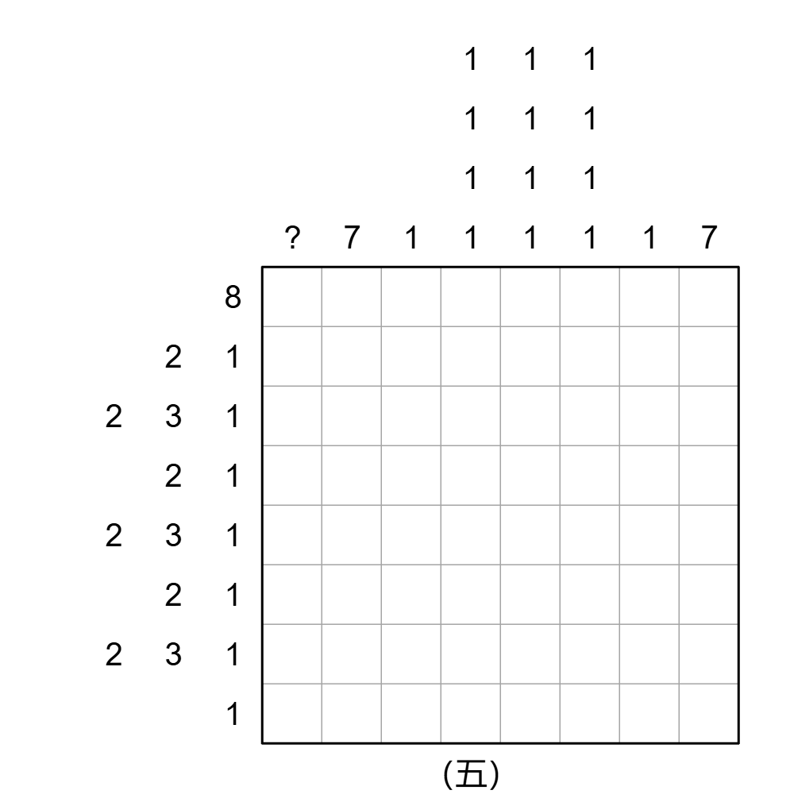

# 千字谜子题 435

## 题面

## 答案

`且`

## 解析

标准规则数织，象形提取

## 本地附件

- [3138a545865746dd8c967ef434e59c07.webp](../../../assets/static.cipherpuzzles.com/static/images/3138a545865746dd8c967ef434e59c07.webp)

来源：[https://ccbc16.cipherpuzzles.com/data/c16-qian-puzzle.json#cid=435](https://ccbc16.cipherpuzzles.com/data/c16-qian-puzzle.json#cid=435)
