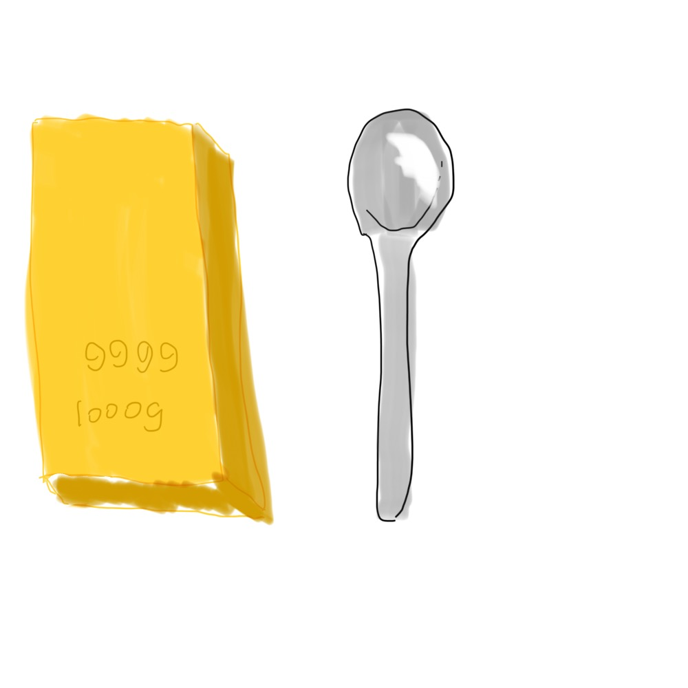

# 千字谜子题 436

## 题面

## 答案

`钓`

## 解析

图片左边是金条的常见形式，代表汉字“金”；右边的勺子代表“勺”。组合起来为钓

## 本地附件

- [776414493c5b4b18a287eecfb16df30a.webp](../../../assets/static.cipherpuzzles.com/static/images/776414493c5b4b18a287eecfb16df30a.webp)

来源：[https://ccbc16.cipherpuzzles.com/data/c16-qian-puzzle.json#cid=436](https://ccbc16.cipherpuzzles.com/data/c16-qian-puzzle.json#cid=436)
