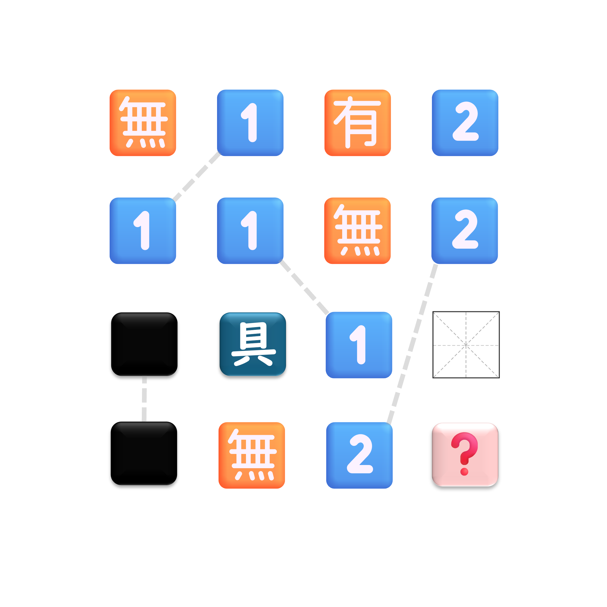

# 千字谜子题 437

## 题面

## 答案

`致`

## 解析

容易得知给出的方阵对应着  无独有偶，独一无二， 别具一格，别无二致 四个成语，故 ? 处的答案为"致"。

## 本地附件

- [c23b7af9ec76418caa893e830cefcf15.webp](../../../assets/static.cipherpuzzles.com/static/images/c23b7af9ec76418caa893e830cefcf15.webp)

来源：[https://ccbc16.cipherpuzzles.com/data/c16-qian-puzzle.json#cid=437](https://ccbc16.cipherpuzzles.com/data/c16-qian-puzzle.json#cid=437)
