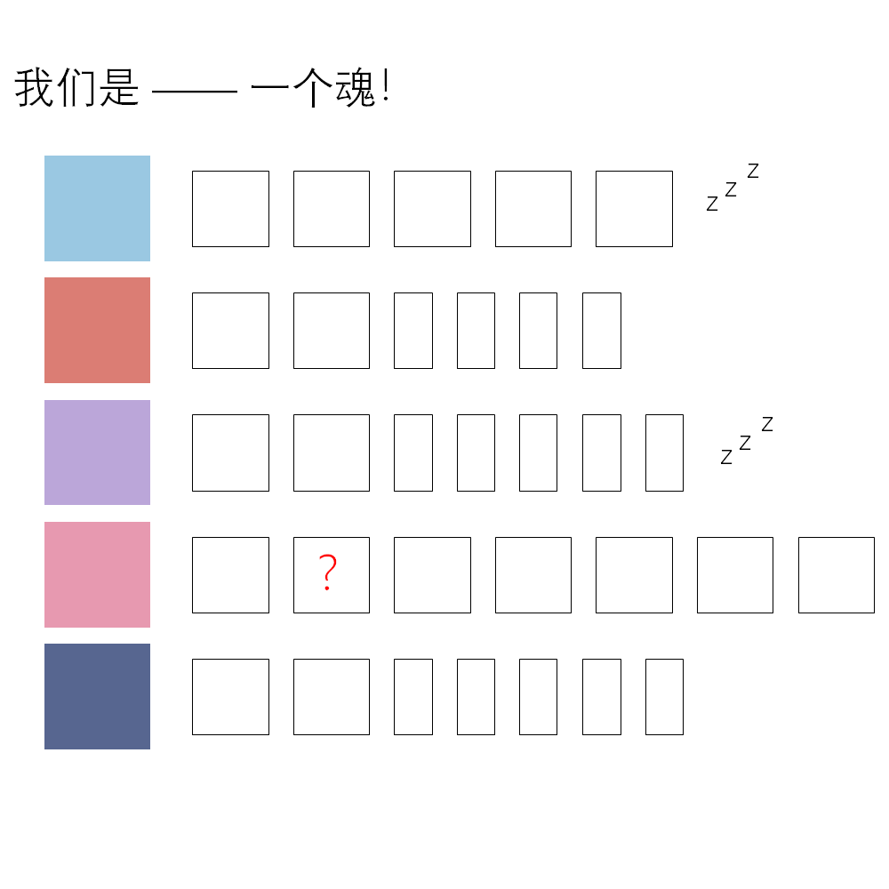

# 千字谜子题 438

## 题面

## 答案

`然`

## 解析

搜索ft可知本题主题为A-SOUL，下面五个色块分别对应五人的主题色，其中zzz表示向晚、珈乐永久休眠中。
方框的数量符合五人的bilibili用户名，从上至下分别为：向晚大魔王、贝拉kira、珈乐Carol、嘉然今天吃什么、乃琳Queen，得到答案“然”。

## 本地附件

- [a17d2da0f97f471495300fc445e03875.webp](../../../assets/static.cipherpuzzles.com/static/images/a17d2da0f97f471495300fc445e03875.webp)

来源：[https://ccbc16.cipherpuzzles.com/data/c16-qian-puzzle.json#cid=438](https://ccbc16.cipherpuzzles.com/data/c16-qian-puzzle.json#cid=438)
