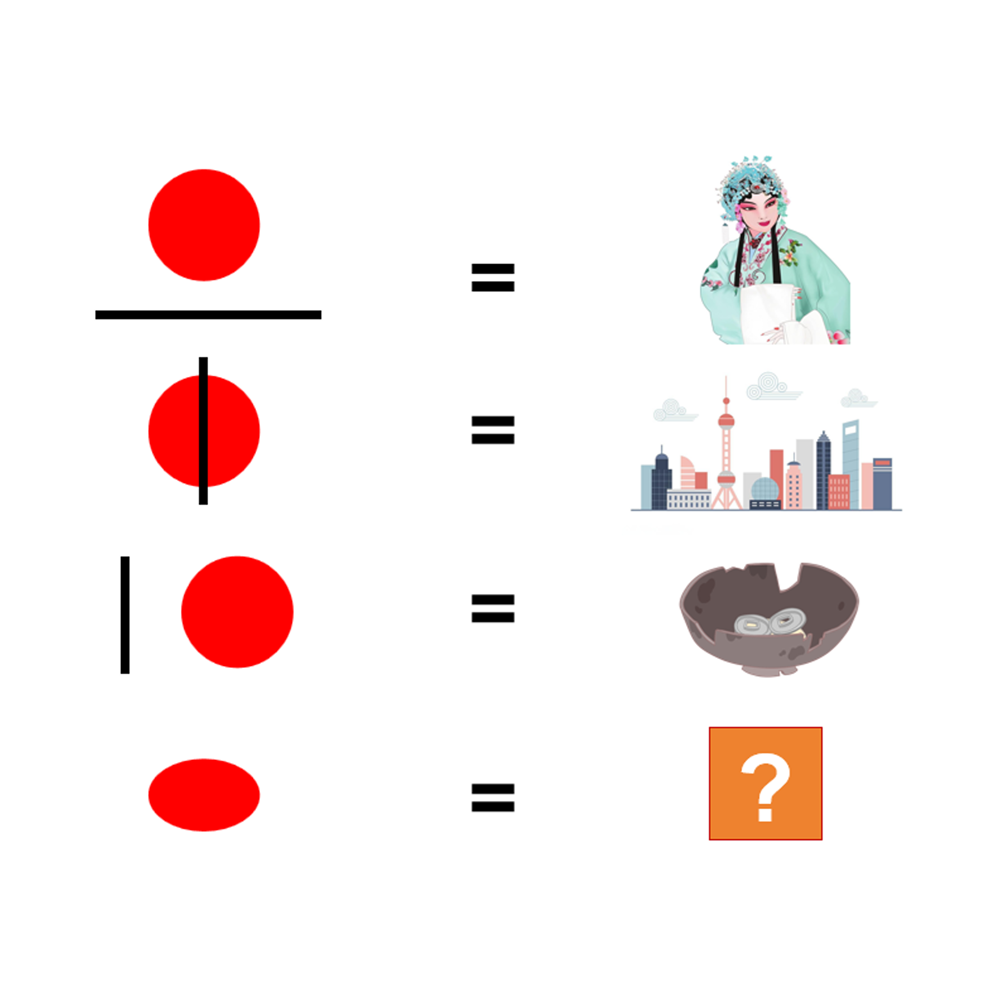

# 千字谜子题 439

## 题面

## 答案

`曰`

## 解析

第一个等式，右侧是京剧的旦角，即【旦】；
第二个等式，右侧是上海的城市天际线，即【申】；
第三个等式，右侧是破旧的碗和陈旧的硬币，联想到【旧】。
综合以上分析，可以得出红色圆形即指【日】，于是在第四行将其“压扁”成为【曰】。

## 本地附件

- [6e172b71eb7d4d208e8a6c1635a975c1.webp](../../../assets/static.cipherpuzzles.com/static/images/6e172b71eb7d4d208e8a6c1635a975c1.webp)

来源：[https://ccbc16.cipherpuzzles.com/data/c16-qian-puzzle.json#cid=439](https://ccbc16.cipherpuzzles.com/data/c16-qian-puzzle.json#cid=439)
