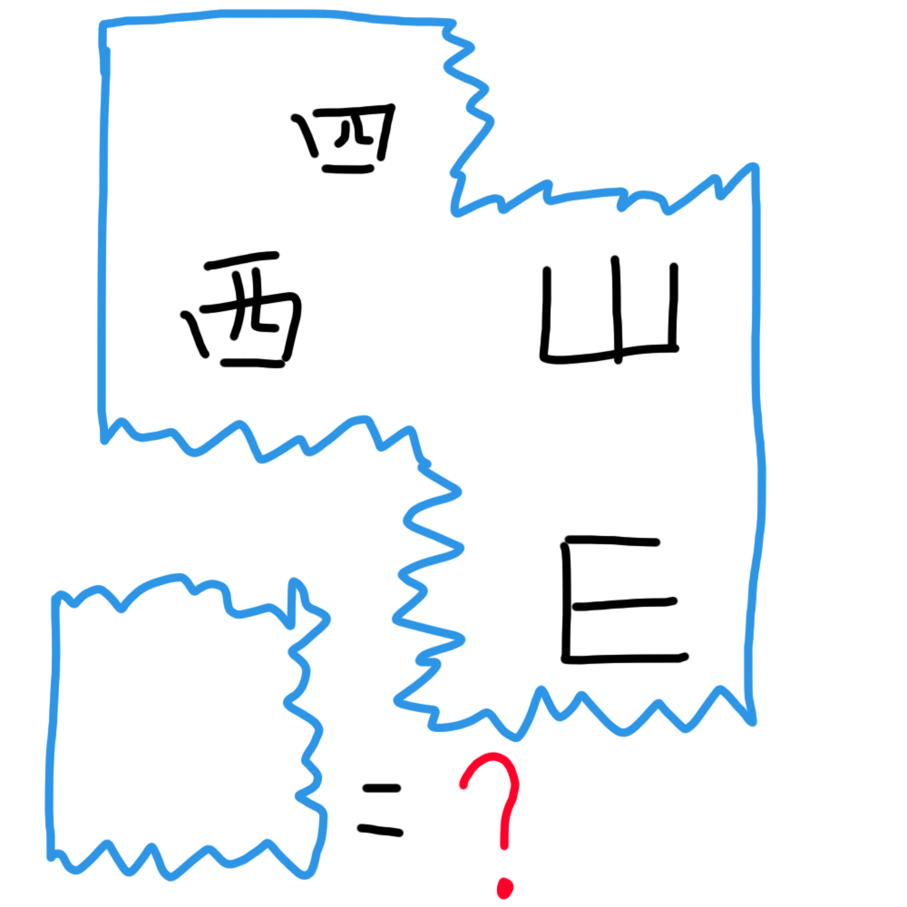

# 千字谜子题 44

## 题面

## 答案

`东`

## 解析

这张纸上写着“四方”的中文和英文首字母。所以左下角的那个碎片上写着E对应的“东”。

## 本地附件

- [4013676fb5a042e68c6861400793fa92.webp](../../../assets/static.cipherpuzzles.com/static/images/4013676fb5a042e68c6861400793fa92.webp)

来源：[https://ccbc16.cipherpuzzles.com/data/c16-qian-puzzle.json#cid=44](https://ccbc16.cipherpuzzles.com/data/c16-qian-puzzle.json#cid=44)
