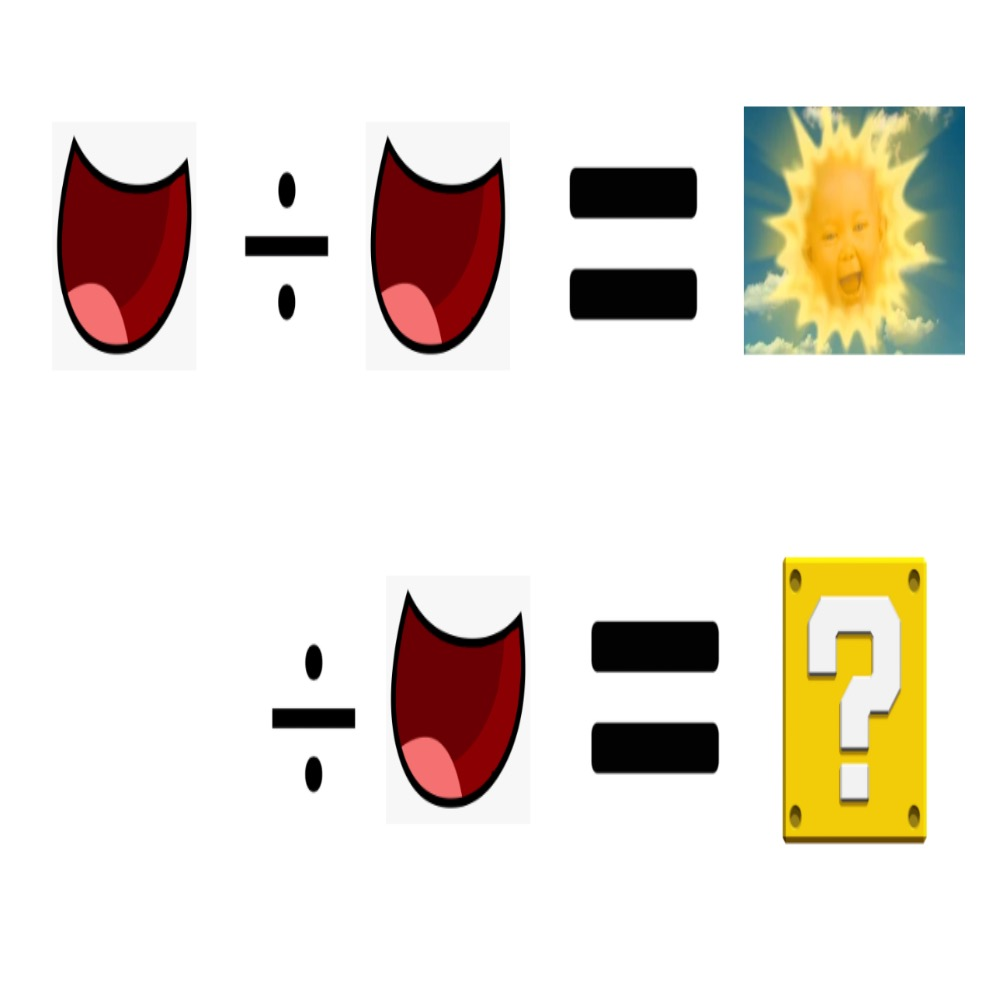

# 千字谜子题 441

## 题面

## 答案

`自`

## 解析

注意 ‘日’ 的形状就像两个 ‘口’。那么÷的意思就是要把这些看成分数。
但是第二行并没有分子，只有空白。

其实分子就是 ‘白’.
把 ‘白’ 和 ‘口’ 放在分子和分母的部位，答案就是‘自’。

====

Notice that "日" (sun) resembles two "口" (mouth) on top of each other. So ÷ means to treat these as fractions.

But the second row has no numerator, o

## 本地附件

- [11fc0da042e0416ab9cac1c44212ff14.webp](../../../assets/static.cipherpuzzles.com/static/images/11fc0da042e0416ab9cac1c44212ff14.webp)

来源：[https://ccbc16.cipherpuzzles.com/data/c16-qian-puzzle.json#cid=441](https://ccbc16.cipherpuzzles.com/data/c16-qian-puzzle.json#cid=441)
