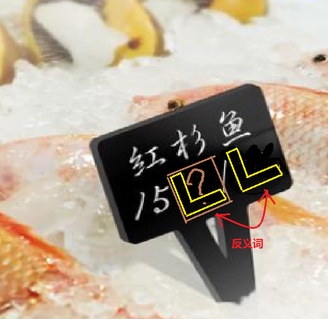

# 千字谜子题 442

## 题面

## 答案

`远`

## 解析

元/斤==》远/近

## 本地附件

- [d66e90419487435b96b495515257c2f7.webp](../../../assets/static.cipherpuzzles.com/static/images/d66e90419487435b96b495515257c2f7.webp)

来源：[https://ccbc16.cipherpuzzles.com/data/c16-qian-puzzle.json#cid=442](https://ccbc16.cipherpuzzles.com/data/c16-qian-puzzle.json#cid=442)
