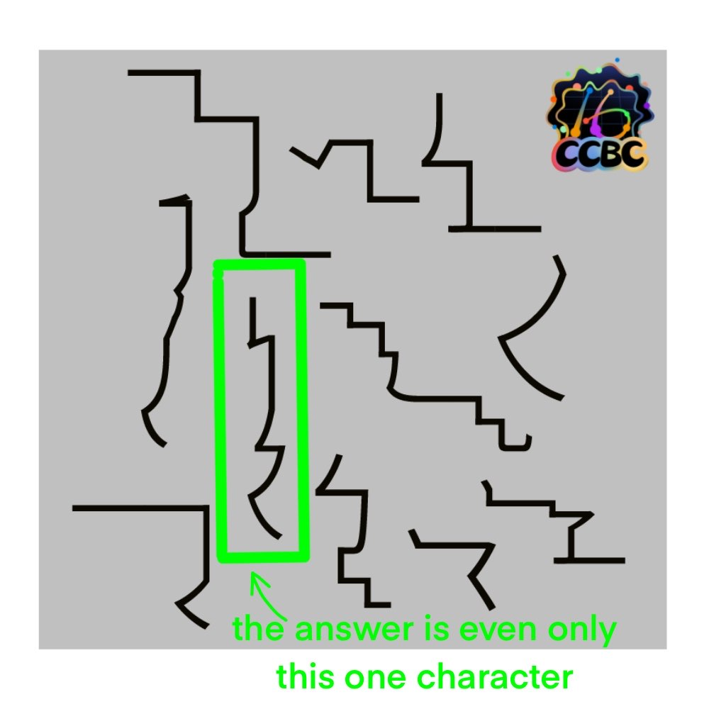

# 千字谜子题 446

## 题面

## 答案

`收`

## 解析

笑点解析：图为CCBC16开篇第一题的题面，将图中的文字一笔画后会得到西江月秋收起义末句六字，而题目中添加的绿框和绿色文字部分已经表明本题的答案“甚至仅仅”是那一个“收”字

## 本地附件

- [6c7334c9c4244c3f98d0ff56c84f19f4.webp](../../../assets/static.cipherpuzzles.com/static/images/6c7334c9c4244c3f98d0ff56c84f19f4.webp)

来源：[https://ccbc16.cipherpuzzles.com/data/c16-qian-puzzle.json#cid=446](https://ccbc16.cipherpuzzles.com/data/c16-qian-puzzle.json#cid=446)
