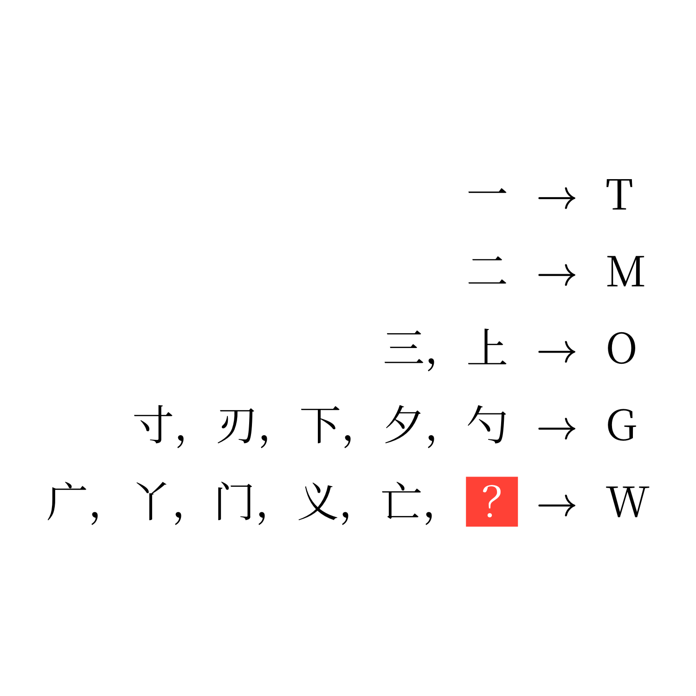

# 千字谜子题 447

## 题面

## 答案

`之`

## 解析

解析：将“点”笔画视作点，将所有其他笔画视作横，按照笔顺使用摩斯密码提取。

例：一 -> - -> T，二 -> -- -> M，寸/刃/下/夕/勺 -> --. -> G。

因为W=.--，所以要找三画且只有第一画是点的字。常用汉字中这样的字只有广、丫、门、义、亡、之。所以答案是*之*。

## 本地附件

- [192fd3db49ba401b879024e82991655a.webp](../../../assets/static.cipherpuzzles.com/static/images/192fd3db49ba401b879024e82991655a.webp)

来源：[https://ccbc16.cipherpuzzles.com/data/c16-qian-puzzle.json#cid=447](https://ccbc16.cipherpuzzles.com/data/c16-qian-puzzle.json#cid=447)
