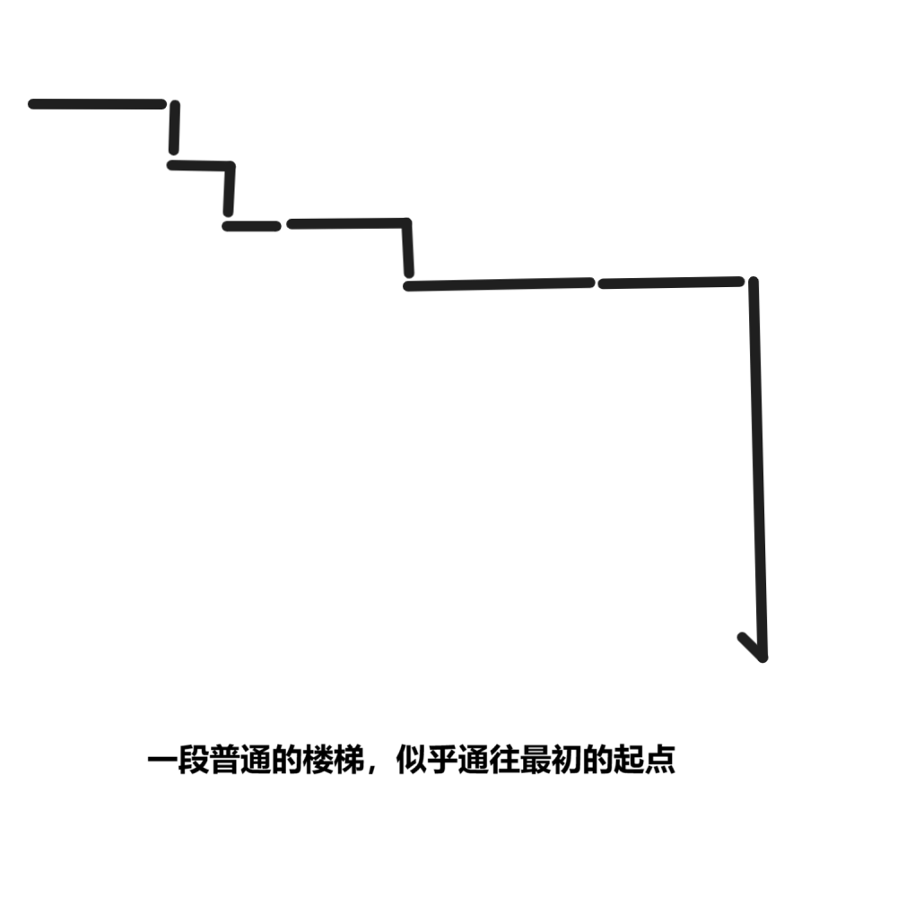

# 千字谜子题 448

## 题面

## 答案

`事`

## 解析

如题目中所说，需要回到序章第1题（一笔画），将图片中的笔画按照该规则重排，可以得到答案“事”。

## 本地附件

- [ee42e1947d1a483c938db2dcbe13bcb3.webp](../../../assets/static.cipherpuzzles.com/static/images/ee42e1947d1a483c938db2dcbe13bcb3.webp)

来源：[https://ccbc16.cipherpuzzles.com/data/c16-qian-puzzle.json#cid=448](https://ccbc16.cipherpuzzles.com/data/c16-qian-puzzle.json#cid=448)
