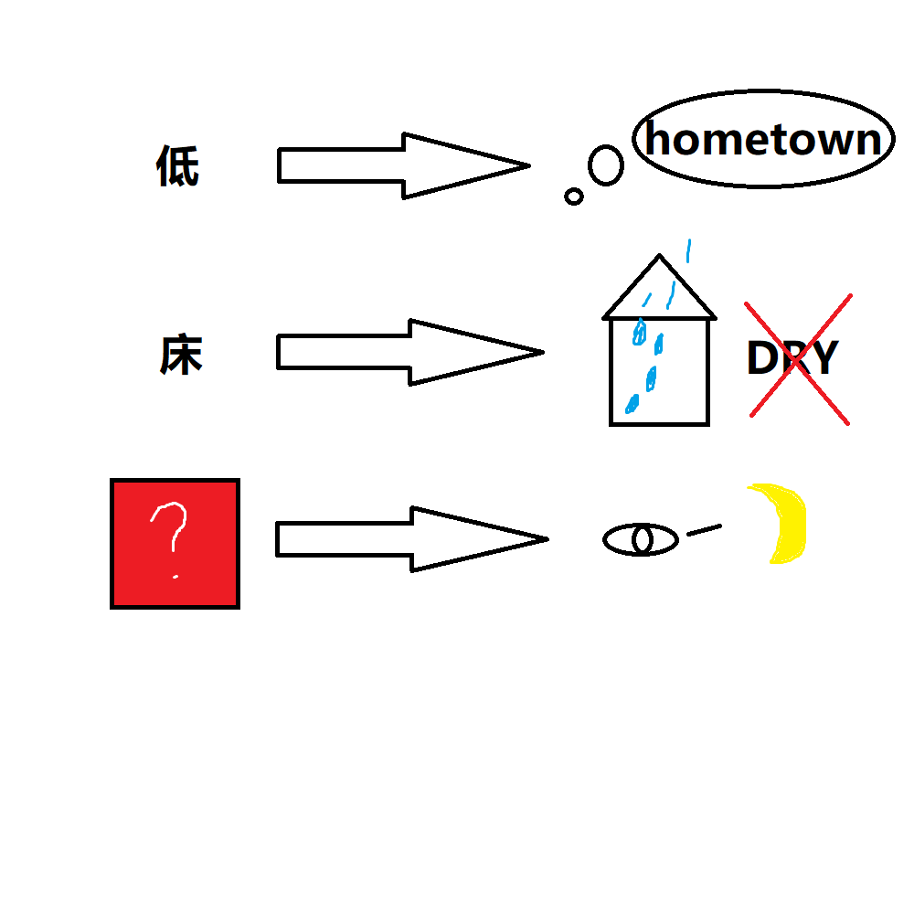

# 千字谜子题 45

## 题面

## 答案

`举`

## 解析

这道题名为无题，其实是在暗示诗词。
可以发现，每行都是指代了第二个字是”头“的诗句。
比如第一句：低头思故乡，第二句：床头屋漏无干处
因此观察最后一行的目光、月亮，可以推出为举头望明月
故问号处是【举】

## 本地附件

- [fcf697aea98a4f3093d991d490a6f3c2.webp](../../../assets/static.cipherpuzzles.com/static/images/fcf697aea98a4f3093d991d490a6f3c2.webp)

来源：[https://ccbc16.cipherpuzzles.com/data/c16-qian-puzzle.json#cid=45](https://ccbc16.cipherpuzzles.com/data/c16-qian-puzzle.json#cid=45)
