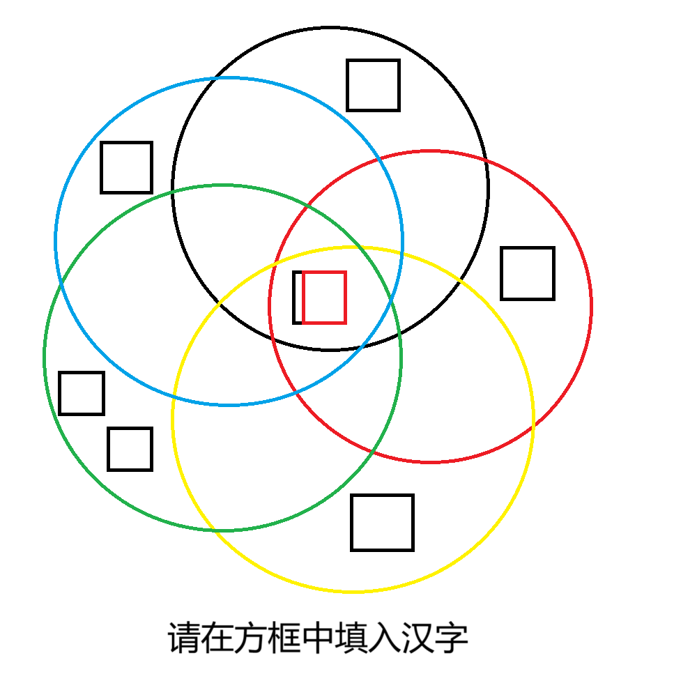

# 千字谜子题 451

## 题面

## 答案

`州`

## 解析

注意到（注意力惊人.jpg）这是五个环，五个环的颜色和奥林匹克的颜色遥相呼应，并且绿环不与其他环交叉的地方有两个方框，可以确定是大洋，五个环的交叉处代表欧洲、亚洲、非洲、美洲、大洋洲这五个词汇有同一个洲字，同时方框中标红的部分是洲字去掉三点水形成的州字，红色也表明了需要提取这个部分，故答案为州

## 本地附件

- [9e2b5781102b4fceac83637077540aed.webp](../../../assets/static.cipherpuzzles.com/static/images/9e2b5781102b4fceac83637077540aed.webp)

来源：[https://ccbc16.cipherpuzzles.com/data/c16-qian-puzzle.json#cid=451](https://ccbc16.cipherpuzzles.com/data/c16-qian-puzzle.json#cid=451)
