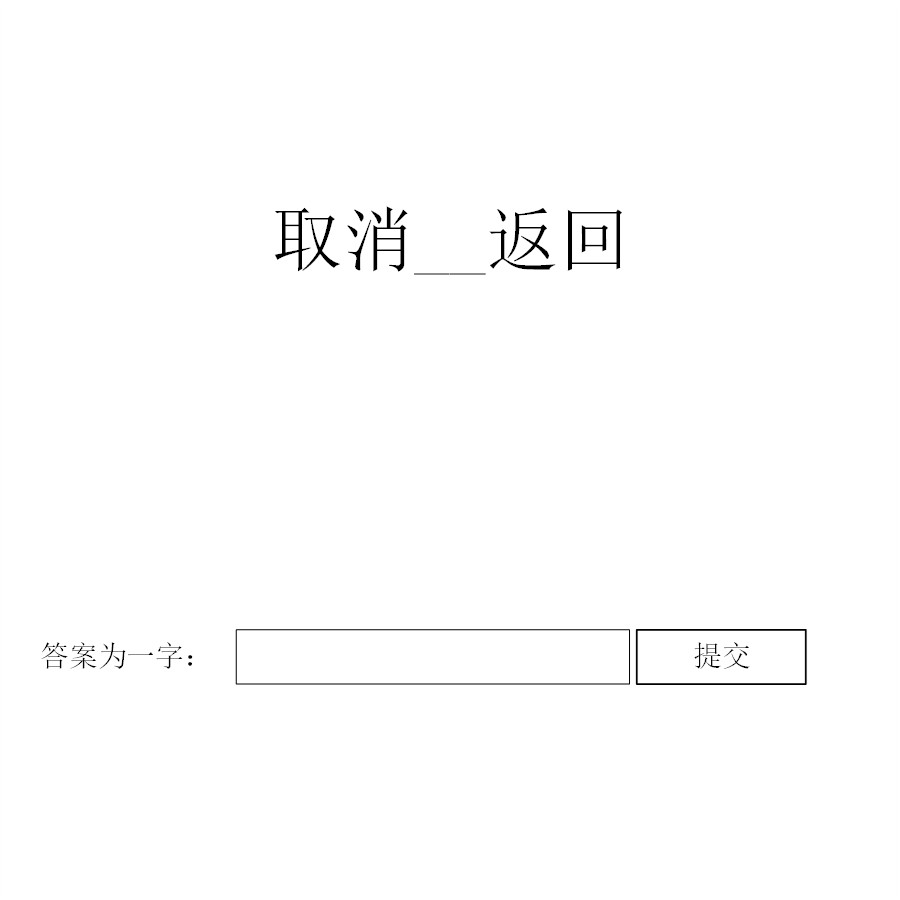

# 千字谜子题 452

## 题面

## 答案

`遣`

## 解析

取消 消遣 遣返 返回

## 本地附件

- [a79c003bc9514f2aa7fcf0d1381e4ded.webp](../../../assets/static.cipherpuzzles.com/static/images/a79c003bc9514f2aa7fcf0d1381e4ded.webp)

来源：[https://ccbc16.cipherpuzzles.com/data/c16-qian-puzzle.json#cid=452](https://ccbc16.cipherpuzzles.com/data/c16-qian-puzzle.json#cid=452)
