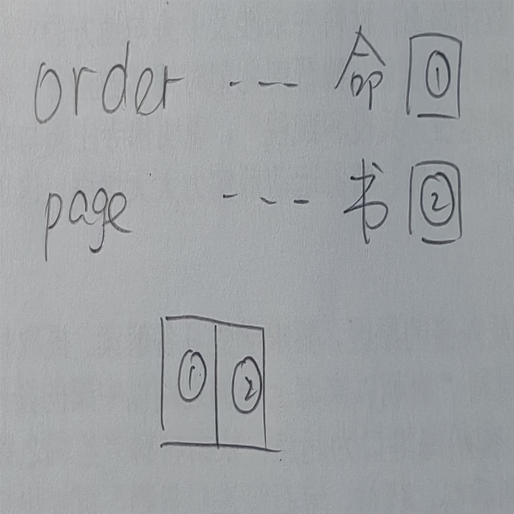

# 千字谜子题 454

## 题面

## 答案

`领`

## 解析

英文翻译，ORDER是命令，page是书页，12组合答案是领

## 本地附件

- [caf0eaf424bc4e27bdaed74d59a1c830.webp](../../../assets/static.cipherpuzzles.com/static/images/caf0eaf424bc4e27bdaed74d59a1c830.webp)

来源：[https://ccbc16.cipherpuzzles.com/data/c16-qian-puzzle.json#cid=454](https://ccbc16.cipherpuzzles.com/data/c16-qian-puzzle.json#cid=454)
