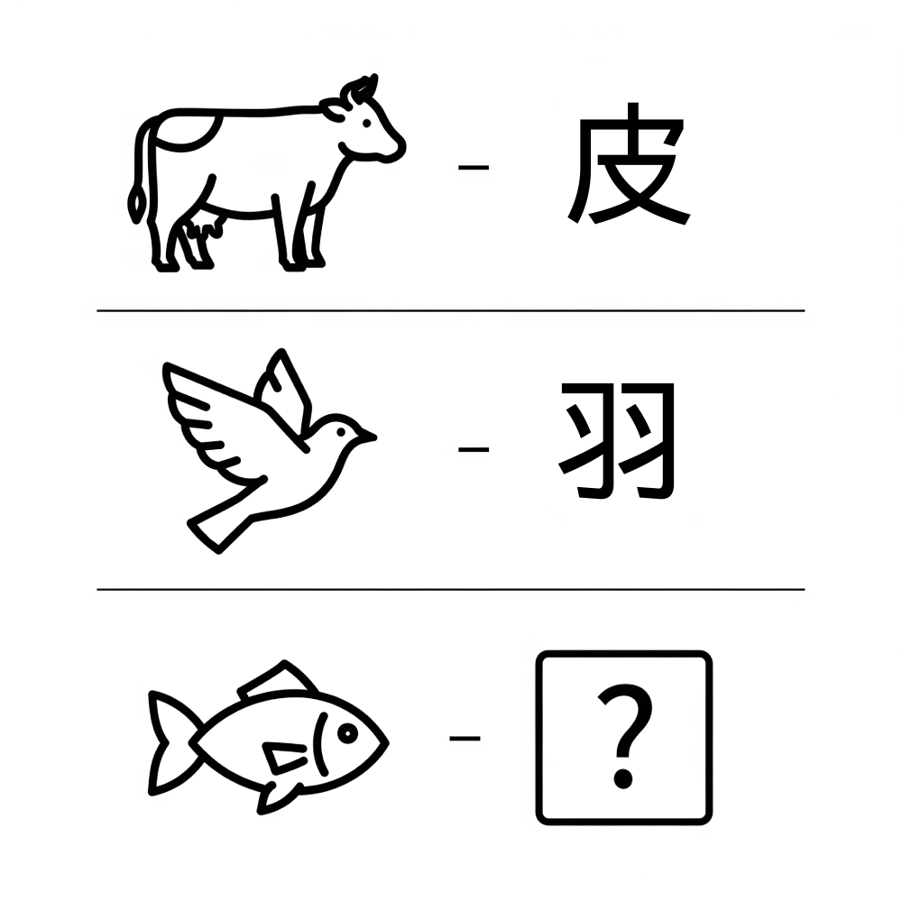

# 千字谜子题 455

## 题面

## 答案

`鳞`

## 解析

比如牛—皮；鸟—羽；鱼——？

## 本地附件

- [85ad07bad999432fb2f2b1465a72bd11.webp](../../../assets/static.cipherpuzzles.com/static/images/85ad07bad999432fb2f2b1465a72bd11.webp)

来源：[https://ccbc16.cipherpuzzles.com/data/c16-qian-puzzle.json#cid=455](https://ccbc16.cipherpuzzles.com/data/c16-qian-puzzle.json#cid=455)
