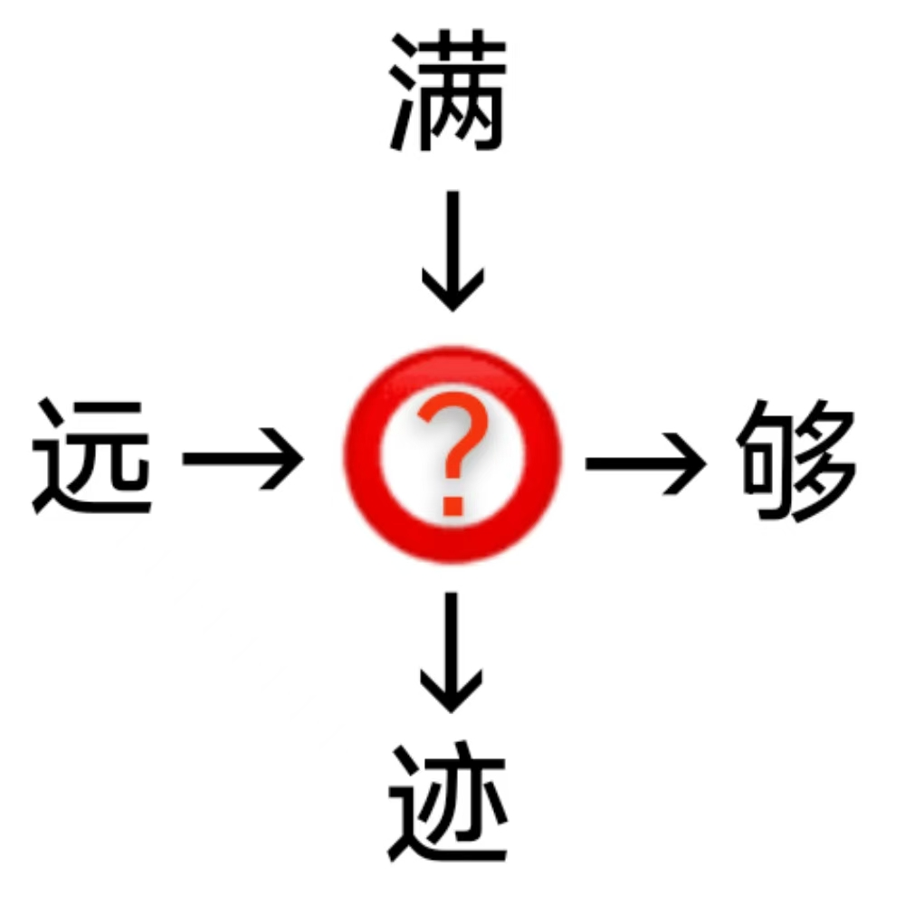

# 千字谜子题 456

## 题面

## 答案

`足`

## 解析

按照箭头方向可以拼成满足，远足，足够，足迹，提取足

## 本地附件

- [011f786f65844a538abf3188854e71bd.webp](../../../assets/static.cipherpuzzles.com/static/images/011f786f65844a538abf3188854e71bd.webp)

来源：[https://ccbc16.cipherpuzzles.com/data/c16-qian-puzzle.json#cid=456](https://ccbc16.cipherpuzzles.com/data/c16-qian-puzzle.json#cid=456)
