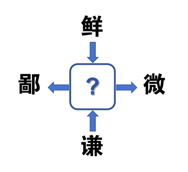

# 千字谜子题 458

## 题面

## 答案

`卑`

## 解析

组词：卑鄙 卑微 鲜卑 谦卑

## 本地附件

- [ee2b8fff5e7e4f7bba88ef7cfc02f400.webp](../../../assets/static.cipherpuzzles.com/static/images/ee2b8fff5e7e4f7bba88ef7cfc02f400.webp)

来源：[https://ccbc16.cipherpuzzles.com/data/c16-qian-puzzle.json#cid=458](https://ccbc16.cipherpuzzles.com/data/c16-qian-puzzle.json#cid=458)
