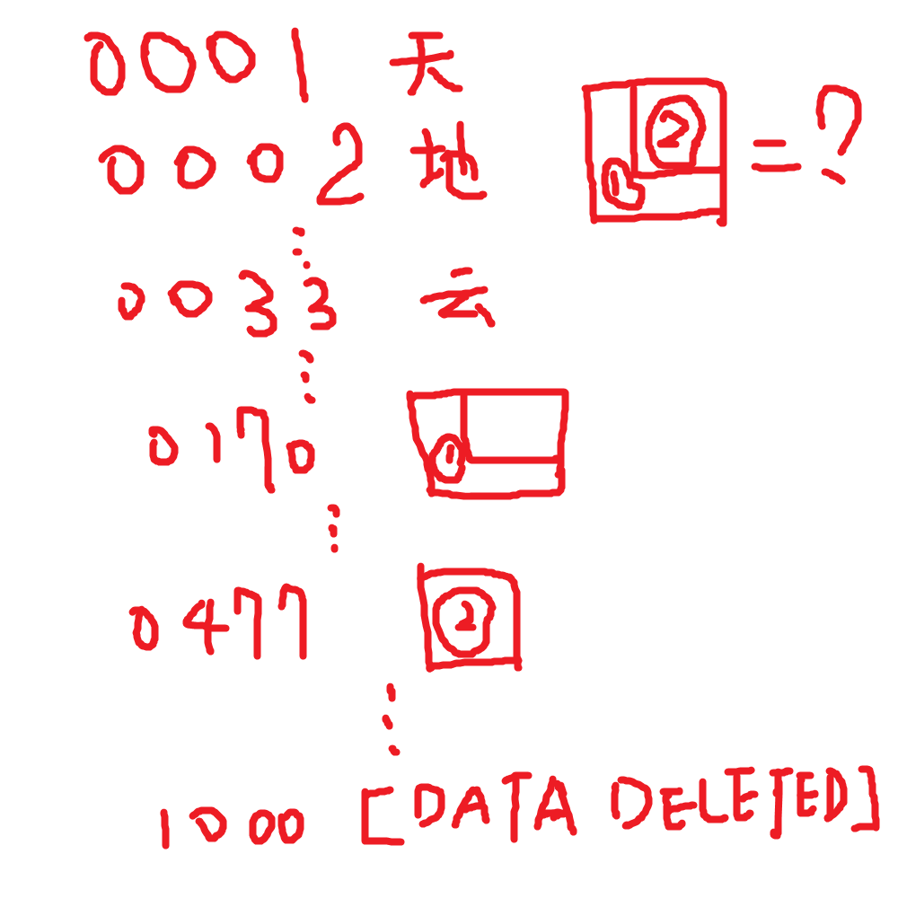

# 千字谜子题 46

## 题面

## 答案

`迹`

## 解析

由0001至1000的编号与天地云等注意到该次序为千字文。0170号为过，0477号为亦，则得到?为“迹”

## 本地附件

- [284c713b41c74ac4b09206ae06d65107.webp](../../../assets/static.cipherpuzzles.com/static/images/284c713b41c74ac4b09206ae06d65107.webp)

来源：[https://ccbc16.cipherpuzzles.com/data/c16-qian-puzzle.json#cid=46](https://ccbc16.cipherpuzzles.com/data/c16-qian-puzzle.json#cid=46)
