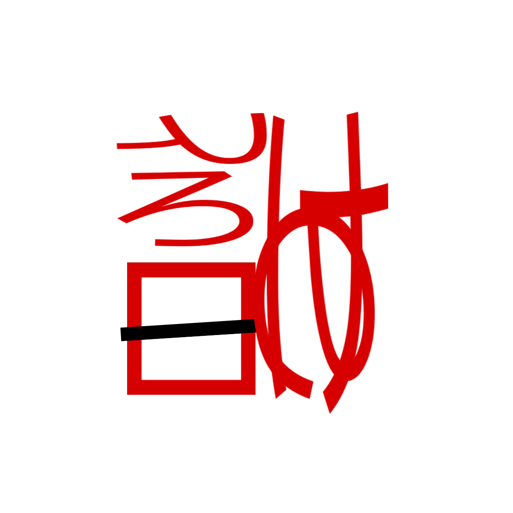

# 千字谜子题 460

## 题面

## 答案

`敦`

## 解析

注意到红色部分是一些平假名或片假名，将平假名转换为片假名，片假名转换为平假名，并按照相同位置及方向放置，可读出“敦”字。

## 本地附件

- [83b2f62a35f8417da550012fd8ce4098.webp](../../../assets/static.cipherpuzzles.com/static/images/83b2f62a35f8417da550012fd8ce4098.webp)

来源：[https://ccbc16.cipherpuzzles.com/data/c16-qian-puzzle.json#cid=460](https://ccbc16.cipherpuzzles.com/data/c16-qian-puzzle.json#cid=460)
