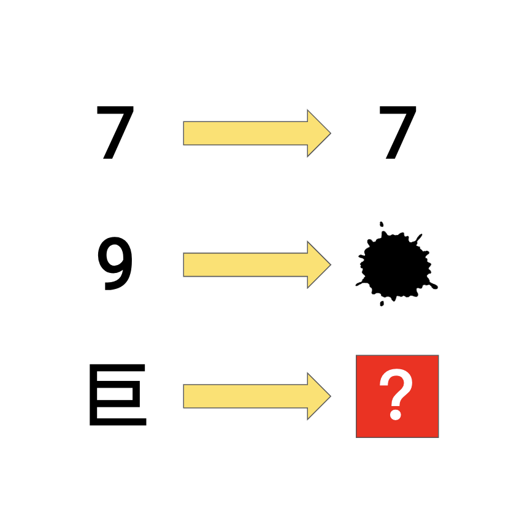

# 千字谜子题 461

## 题面

## 答案

`渠`

## 解析

由前两个字得到七→柒，九→染，因而得到最后一个字巨→渠。

## 本地附件

- [a135d7c98e7347e985aff46ddb0e6f41.webp](../../../assets/static.cipherpuzzles.com/static/images/a135d7c98e7347e985aff46ddb0e6f41.webp)

来源：[https://ccbc16.cipherpuzzles.com/data/c16-qian-puzzle.json#cid=461](https://ccbc16.cipherpuzzles.com/data/c16-qian-puzzle.json#cid=461)
