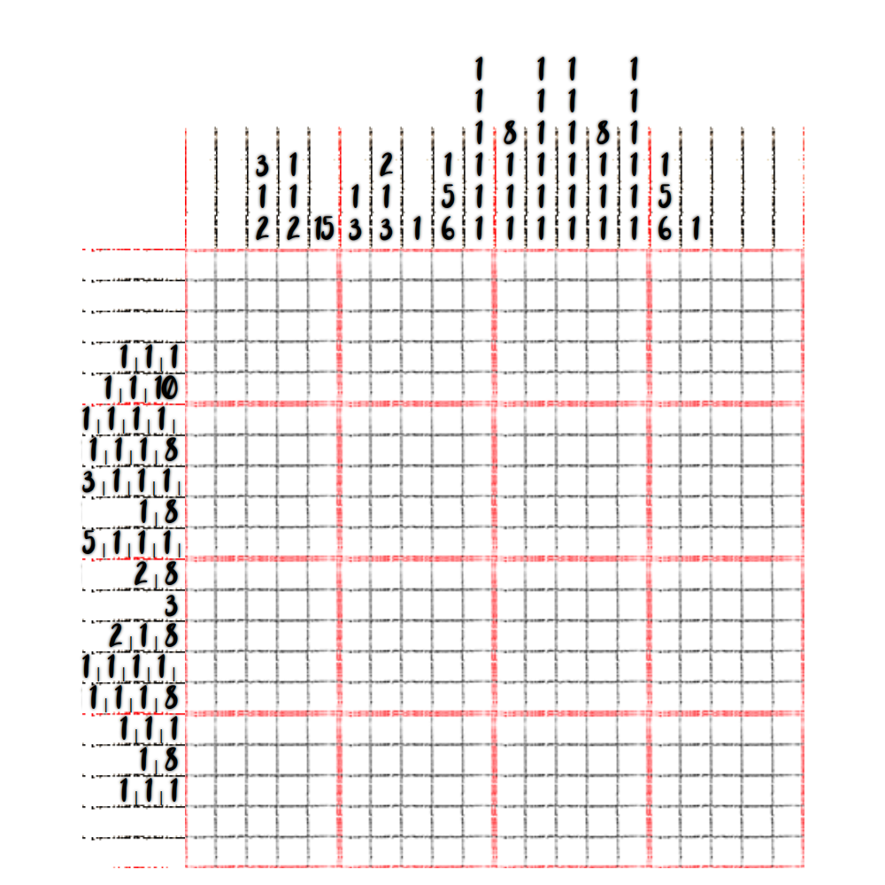

# 千字谜子题 462

## 题面

## 答案

`糟`

## 解析

Nonogram, fill this out and it will look like 糟

## 本地附件

- [26fab443ea6442a79e88f08bc6ce0de2.webp](../../../assets/static.cipherpuzzles.com/static/images/26fab443ea6442a79e88f08bc6ce0de2.webp)

来源：[https://ccbc16.cipherpuzzles.com/data/c16-qian-puzzle.json#cid=462](https://ccbc16.cipherpuzzles.com/data/c16-qian-puzzle.json#cid=462)
