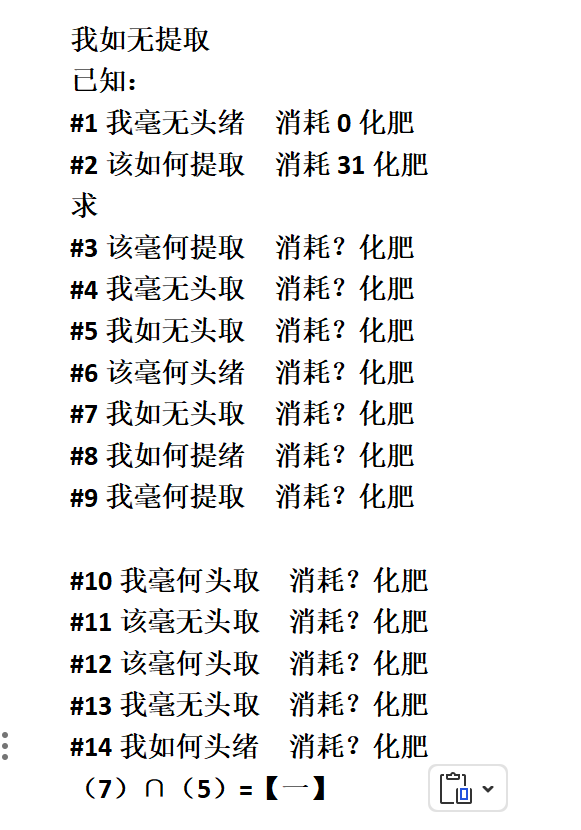

# 千字谜子题 463

## 题面

## 答案

`等`

## 解析

我毫无头绪=00000
该如何提取=11111
二进制提取出（7）=waiting （5）=equal，两者取交集得一字即为【等】（等待∩等于）
btw,化肥是谐音C15的话费，到底能不能提现啊，我当时攒了两万就是为了提现的（

## 本地附件

- [36d52eace0604ec2b3f424444d8fe78c.webp](../../../assets/static.cipherpuzzles.com/static/images/36d52eace0604ec2b3f424444d8fe78c.webp)

来源：[https://ccbc16.cipherpuzzles.com/data/c16-qian-puzzle.json#cid=463](https://ccbc16.cipherpuzzles.com/data/c16-qian-puzzle.json#cid=463)
