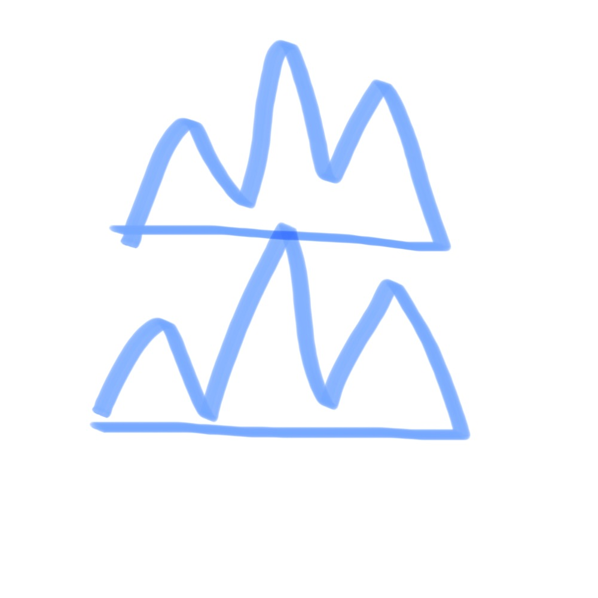

# 千字谜子题 464

## 题面

## 答案

`出`

## 解析

“出”的象形版

## 本地附件

- [e953568883ec45eb87b21120a37b7740.webp](../../../assets/static.cipherpuzzles.com/static/images/e953568883ec45eb87b21120a37b7740.webp)

来源：[https://ccbc16.cipherpuzzles.com/data/c16-qian-puzzle.json#cid=464](https://ccbc16.cipherpuzzles.com/data/c16-qian-puzzle.json#cid=464)
