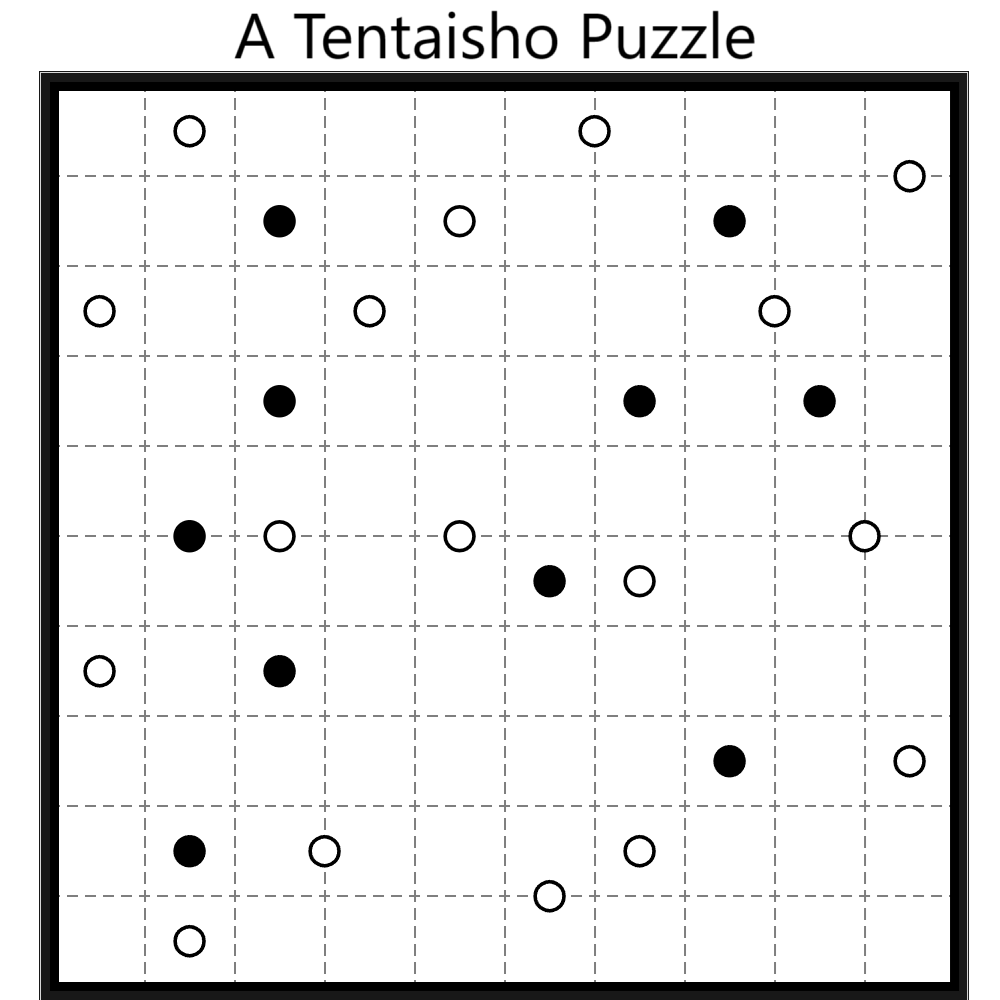

# 千字谜子题 465

## 题面

## 答案

`所`

## 解析

解决这个tentaisho纸笔谜题，将黑点所在格子涂黑，象形得到“所”字。

## 本地附件

- [34f7a1eed8e24e80b3d52825cccff964.webp](../../../assets/static.cipherpuzzles.com/static/images/34f7a1eed8e24e80b3d52825cccff964.webp)

来源：[https://ccbc16.cipherpuzzles.com/data/c16-qian-puzzle.json#cid=465](https://ccbc16.cipherpuzzles.com/data/c16-qian-puzzle.json#cid=465)
