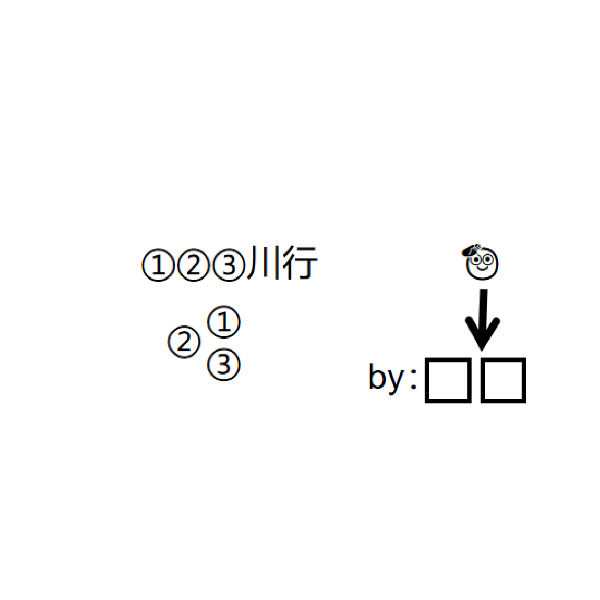

# 千字谜子题 466

## 题面

## 答案

`端`

## 解析

端可以拆成“山 立 而”三个字。 李壁《庄敬日强斋二首》有云：“山立而川行”因此借此诗句出题。 右边emoji为敬礼图像，用意是在搜索古诗时能够给予一些提示。 经测试此诗在搜索“川行”的情况下出现在古诗文网的第二页，因此应当是可做的。

## 本地附件

- [760c1c97dff64f1abfc32c107afadbca.webp](../../../assets/static.cipherpuzzles.com/static/images/760c1c97dff64f1abfc32c107afadbca.webp)

来源：[https://ccbc16.cipherpuzzles.com/data/c16-qian-puzzle.json#cid=466](https://ccbc16.cipherpuzzles.com/data/c16-qian-puzzle.json#cid=466)
