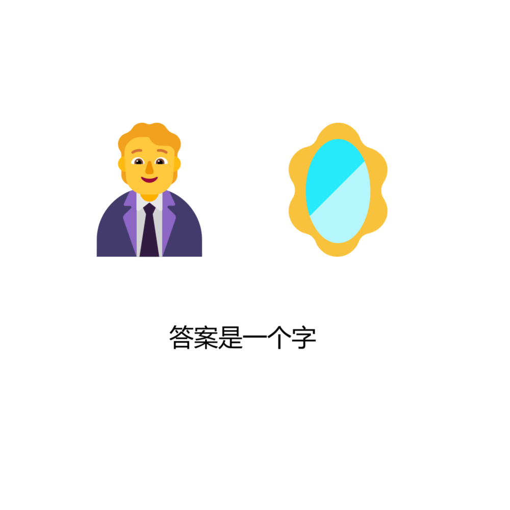

# 千字谜子题 467

## 题面

## 答案

`入`

## 解析

两个 emoji 分别表示人、镜像对称。依照题意执行即可得到答案。

## 本地附件

- [1f854dfb6ed14e7598ea5bdc504082fc.webp](../../../assets/static.cipherpuzzles.com/static/images/1f854dfb6ed14e7598ea5bdc504082fc.webp)

来源：[https://ccbc16.cipherpuzzles.com/data/c16-qian-puzzle.json#cid=467](https://ccbc16.cipherpuzzles.com/data/c16-qian-puzzle.json#cid=467)
