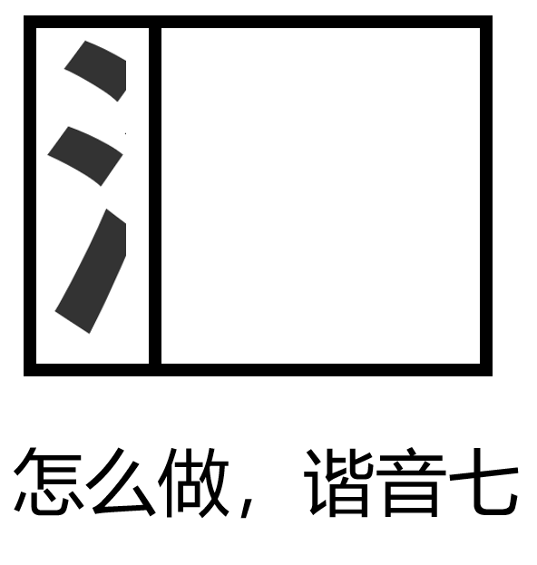

# 千字谜子题 468

## 题面

## 答案

`漆`

## 解析

做题目，看提示，是谐音，答是漆

## 本地附件

- [5a9a7e2ba8bf4b17a3961bffa42e46f4.webp](../../../assets/static.cipherpuzzles.com/static/images/5a9a7e2ba8bf4b17a3961bffa42e46f4.webp)

来源：[https://ccbc16.cipherpuzzles.com/data/c16-qian-puzzle.json#cid=468](https://ccbc16.cipherpuzzles.com/data/c16-qian-puzzle.json#cid=468)
