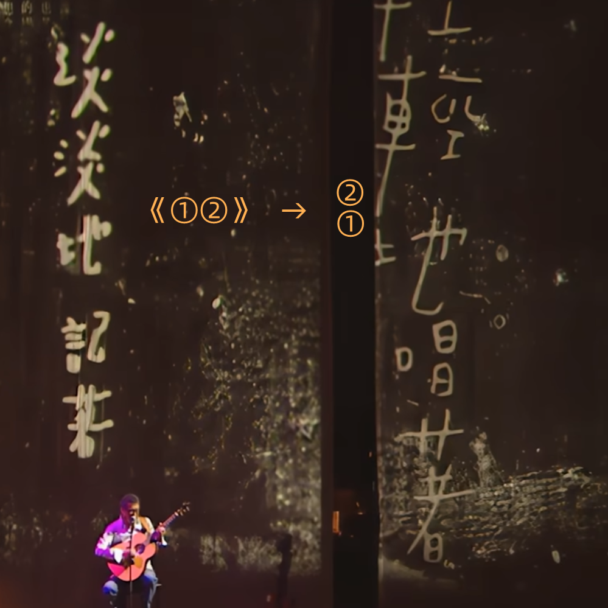

# 千字谜子题 469

## 题面

## 答案

`岳`

## 解析

图片为李宗盛演唱的《山丘》，可以通过大屏幕上的歌词以及歌手照片检索出，谜面已经提示将歌名中的两个字上下组合，得到答案“岳”

## 本地附件

- [fd0adae8a0b848c4a6d53b0e12d07d88.webp](../../../assets/static.cipherpuzzles.com/static/images/fd0adae8a0b848c4a6d53b0e12d07d88.webp)

来源：[https://ccbc16.cipherpuzzles.com/data/c16-qian-puzzle.json#cid=469](https://ccbc16.cipherpuzzles.com/data/c16-qian-puzzle.json#cid=469)
