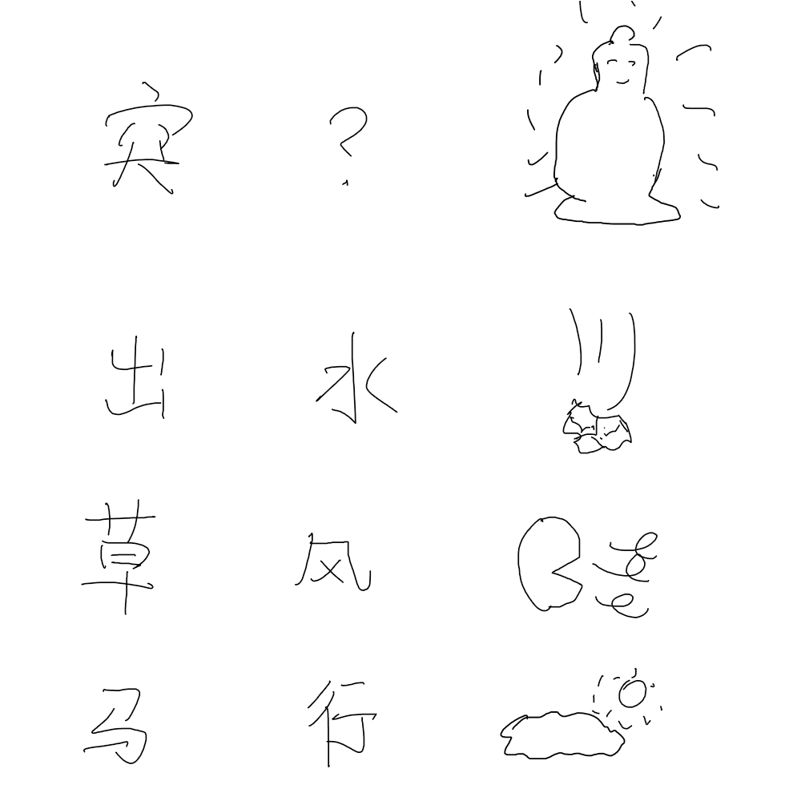

# 千字谜子题 47

## 题面

## 答案

`其`

## 解析

每个图片代表两个字，需要组装图中的字以组成词语：
突+？+如来=突如其来
出+水+落石=水落石出
草+风+吹动=风吹草动
马+行+天空=天马行空
提取缺了的字“其”

## 本地附件

- [aa345618e4054136987074b8d490bffa.webp](../../../assets/static.cipherpuzzles.com/static/images/aa345618e4054136987074b8d490bffa.webp)

来源：[https://ccbc16.cipherpuzzles.com/data/c16-qian-puzzle.json#cid=47](https://ccbc16.cipherpuzzles.com/data/c16-qian-puzzle.json#cid=47)
