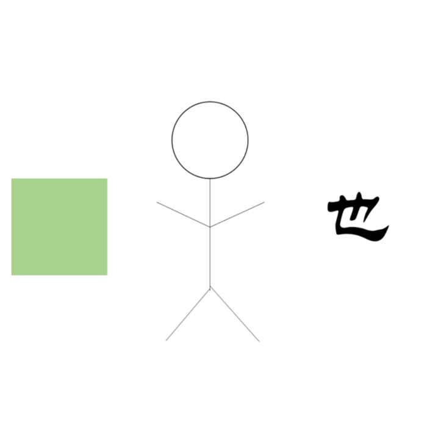

# 千字谜子题 472

## 题面

## 答案

`施`

## 解析

左边的正方形代表“方”，中间的是“人”，加上右边的“也”就是“方人也”，即“施”

## 本地附件

- [72bedb73c98c41d9b6537b6e4ef617cc.webp](../../../assets/static.cipherpuzzles.com/static/images/72bedb73c98c41d9b6537b6e4ef617cc.webp)

来源：[https://ccbc16.cipherpuzzles.com/data/c16-qian-puzzle.json#cid=472](https://ccbc16.cipherpuzzles.com/data/c16-qian-puzzle.json#cid=472)
