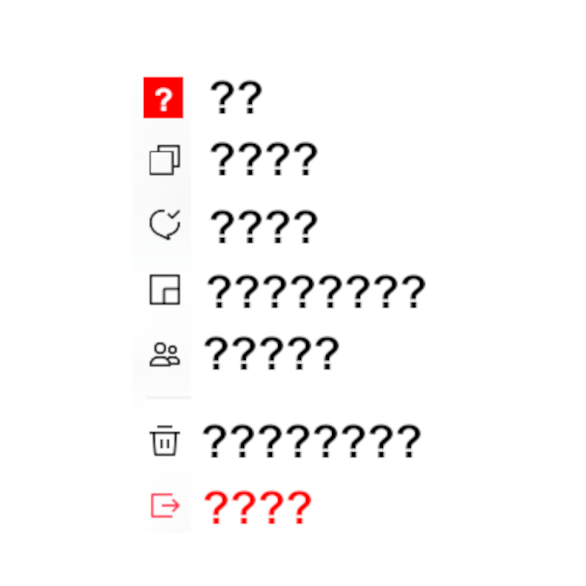

# 千字谜子题 475

## 题面

## 答案

`不`

## 解析

_官方存档未填写解析。_

## 本地附件

- [0d2186bad65b404ab3e45ac91852e814.webp](../../../assets/static.cipherpuzzles.com/static/images/0d2186bad65b404ab3e45ac91852e814.webp)

来源：[https://ccbc16.cipherpuzzles.com/data/c16-qian-puzzle.json#cid=475](https://ccbc16.cipherpuzzles.com/data/c16-qian-puzzle.json#cid=475)
