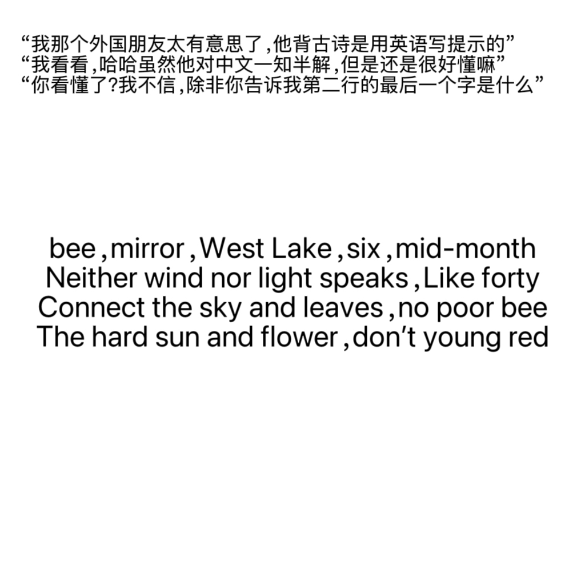

# 千字谜子题 476

## 题面

## 答案

`同`

## 解析

题面为《晓出净慈寺送林子方》4句诗词的英文谐音直译或音译：
毕，镜，西湖，六，月中（毕竟西湖六月中）
风和光都不语，像四十一样（风光不与四时同）
连接天空和叶子，没有贫穷的碧（接天莲叶无穷碧）
坚硬的太阳和花，别样红（映日荷花别样红）

需按对话提示，回答第二行的尾字——“同”

## 本地附件

- [88692026dc8c48138b68664187c9c647.webp](../../../assets/static.cipherpuzzles.com/static/images/88692026dc8c48138b68664187c9c647.webp)

来源：[https://ccbc16.cipherpuzzles.com/data/c16-qian-puzzle.json#cid=476](https://ccbc16.cipherpuzzles.com/data/c16-qian-puzzle.json#cid=476)
