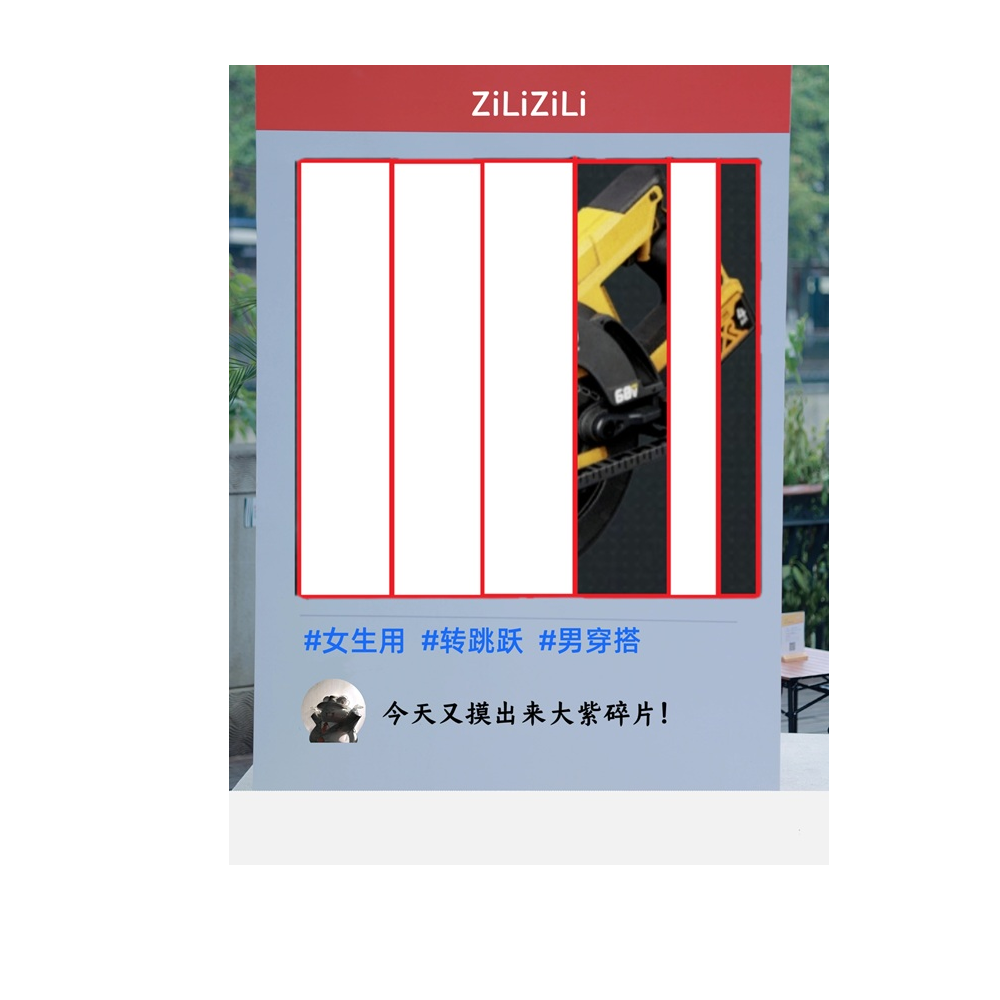

# 千字谜子题 477

## 题面

## 答案

`据`

## 解析

PLOG的照片是《三角洲行动》中的紫色（稀有度）物品：自旋型手锯，保留了“手”和“居”部分的图片，组合起来就是“据”字。蓝色字tag提示了“自”“旋”“型”帮助找到这是什么物品。LOG中的“大紫碎片”提示了将该物品分为了若干部分，只得到了“手”“居”部分。

## 本地附件

- [b0d3308e26ce4af887cf07010fdcb585.webp](../../../assets/static.cipherpuzzles.com/static/images/b0d3308e26ce4af887cf07010fdcb585.webp)

来源：[https://ccbc16.cipherpuzzles.com/data/c16-qian-puzzle.json#cid=477](https://ccbc16.cipherpuzzles.com/data/c16-qian-puzzle.json#cid=477)
