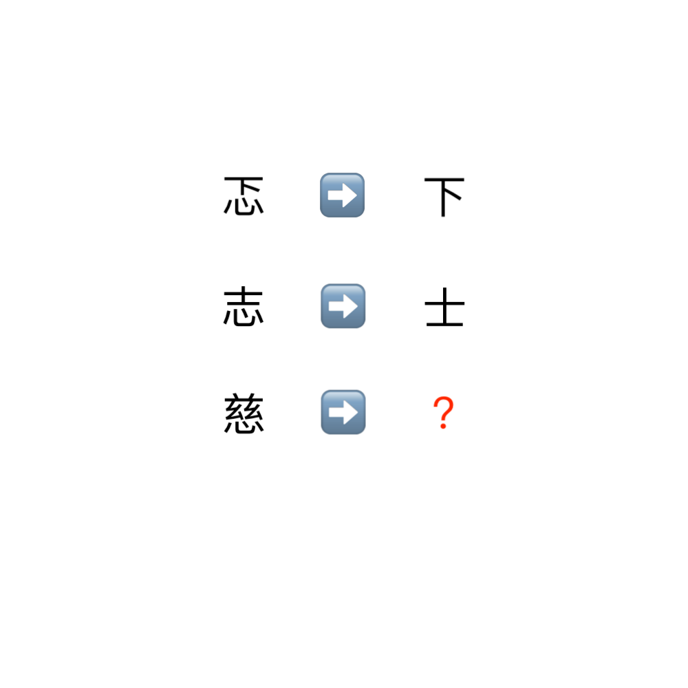

# 千字谜子题 478

## 题面

## 答案

`兹`

## 解析

这题找字的变换规律，忑变成下和志变成士都是去掉了心字旁，所以慈去掉心字旁变兹就是答案。

## 本地附件

- [ed9f42fbd10c483eb323d921c26fe352.webp](../../../assets/static.cipherpuzzles.com/static/images/ed9f42fbd10c483eb323d921c26fe352.webp)

来源：[https://ccbc16.cipherpuzzles.com/data/c16-qian-puzzle.json#cid=478](https://ccbc16.cipherpuzzles.com/data/c16-qian-puzzle.json#cid=478)
