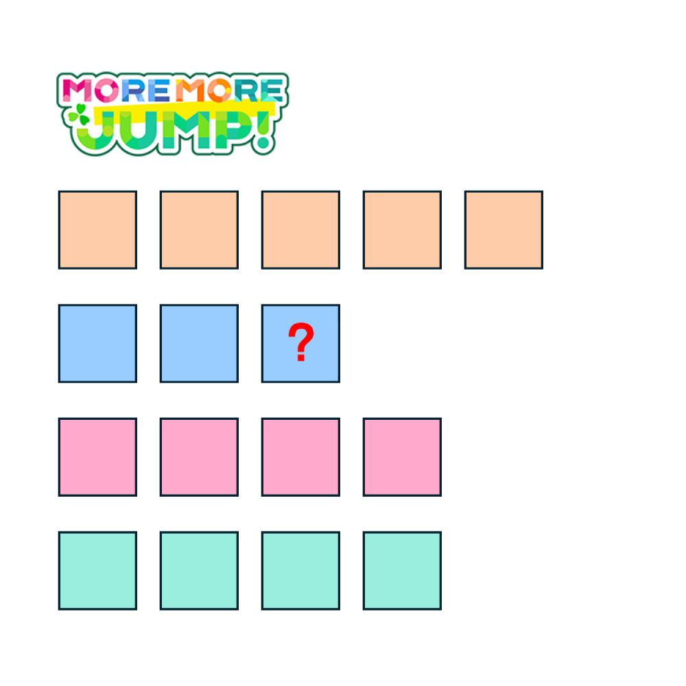

# 千字谜子题 479

## 题面

## 答案

`遥`

## 解析

矩形的色块和个数分别对应了MORE MORE JUMP!中的四位角色及其中文名字，问号处对应“桐谷遥”的“遥”

## 本地附件

- [e1b6040fb528453ca85f6d03046132c7.webp](../../../assets/static.cipherpuzzles.com/static/images/e1b6040fb528453ca85f6d03046132c7.webp)

来源：[https://ccbc16.cipherpuzzles.com/data/c16-qian-puzzle.json#cid=479](https://ccbc16.cipherpuzzles.com/data/c16-qian-puzzle.json#cid=479)
