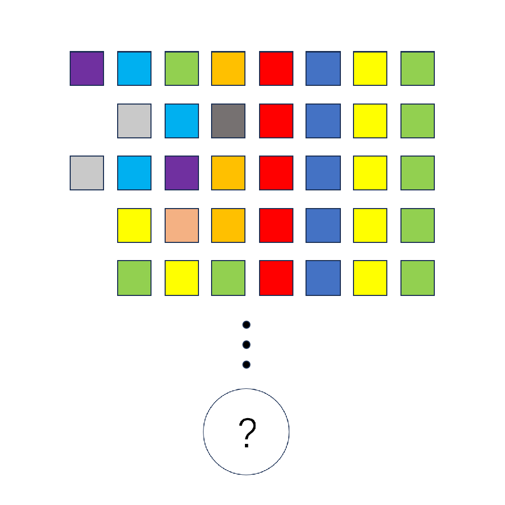

# 千字谜子题 48

## 题面

## 答案

`圆`

## 解析

同字母同颜色，图中单词为pentagon hexagon heptagon octagon nonagon，由省略号类推其图形趋近于圆，故答案为【圆】。

## 本地附件

- [49cf9615e396407b9cff0edcc5efc897.webp](../../../assets/static.cipherpuzzles.com/static/images/49cf9615e396407b9cff0edcc5efc897.webp)

来源：[https://ccbc16.cipherpuzzles.com/data/c16-qian-puzzle.json#cid=48](https://ccbc16.cipherpuzzles.com/data/c16-qian-puzzle.json#cid=48)
